# 2026年最新 便宜机场 低价机场 划算机场 平价机场 白嫖机场 免费机场 性价比机场

<table>
  <thead>
    <tr>
      <th align="center" style="height: 150px;">
        <a href="./articles/payy/payy.md">           
          Payy卡 
          免费无门槛Visa卡
        </a>
      </th>
      <th align="center" style="height: 150px;">
        <a href="https://sink.cheapairports.dpdns.org/gptgod-online">           
          GPT-GOD AI API 中转站 
          每天签到领2000积分，满足日常免费使用
        </a>
      </th>
      <th align="center" style="height: 150px;">
        <a href="https://sink.cheapairports.dpdns.org/yunwu">           
          云雾 API 中转站 
          全网最低价，0.5元充值1⚡️，可签到
        </a>
      </th>
    </tr>
  </thead>
</table>

| 序号 | 机场名（点击跳转详情） | 官网 | 最低价套餐 |
| -------- | -------- | -------- | -------- |
| 1    | [悦通](#悦通) | [官网](https://sink.cheapairports.dpdns.org/648txr) | 59.9元/年,200G/月(平均5元/月),14.9元/月 1000g,送Emby |
| 2    | [糯米](#糯米) | [官网](https://sink.cheapairports.dpdns.org/233sxx) | 12元/年,100G/月(平均1元/月),含家宽,商宽,GIA等专线|
| 3    | [飞狗](#飞狗) | [官网](https://sink.cheapairports.dpdns.org/krj4u9) | 6元/季 100G/月(平均2元/月) |
| 4    | [雪山机场](#雪山机场) | [官网](https://sink.cheapairports.dpdns.org/m82fux) | 39.9元/年 200G/月(平均3.3元/月),9.9元/月 500G,送Emby,含家宽 |
| 5    | [渔云](#渔云) | [官网](https://sink.cheapairports.dpdns.org/7rkg4k) | 60元/年 148G/月(平均5元/月),送Emby |
| 6    | [星链机场](#星链机场) | [官网](https://sink.cheapairports.dpdns.org/3h2qg2) | 9.9元/年 300G/月(平均0.82元/月) |
| 7    | [狗子云](#狗子云) | [官网](https://sink.cheapairports.dpdns.org/xhjy5m) | 3元/月 168G/月,含动态住宅IP |
| 8    | [一分机场](#一分机场) | [官网](https://sink.cheapairports.dpdns.org/6ba6cf) | 2元/月 100G/月 |
| 9    | [蜜雪冰城](#蜜雪冰城) | [官网](https://sink.cheapairports.dpdns.org/hwm7wr) | 3元/月 100G/月 |
| 10   | [便宜机场](#便宜机场) | [官网](https://sink.cheapairports.dpdns.org/f2j64s) | 13元/年 100G/月(平均1.08元/月)每月发白嫖码 |

**联系我：**

Email: pianyijichang@proton.me

### Tag

真正的老牌机场，第一梯队机场，如果不想折腾，想要一步到位的，可以选择 TAG

开业时间：2018年

特点：
* 老板肉身在香港，作为老牌机场价格偏高，但是质量和稳定性也非常好，适合追求极致体验的用户
* 250+ 条高速线路，覆盖全球 100+ 个国家和地区(含卫星网络)，家宽地区为：香港、澳门、台湾、新加坡、日本、马来西亚、越南、加拿大、美国，有原生节点
* 落地：香港有G-Core商宽、HGC商宽、HKT家宽，日本有G-Core、Kirino、Kirin、Catixs、IDCF、Sonet索尼宽带、KDDI、软银家宽等，新加坡Kirino、M1家宽、Whiz家宽。美国10余个落地节点，不同商家，美国AT&T家宽。加拿大BCE家宽，澳门CTM家宽，马来西亚有TM家宽、Maxis商宽，新西兰Vodafone家宽
* IEPL专线SS机场，稳定性高延迟低
* 解锁Netfilx、Hulu、HBO、Disney+、Dazn等主流流媒体平台的区域限制
* 解锁ChatGPT、Claude、 Gemini、Cursor等主流 AI 工具的区域限制

[TAG官网](https://sink.cheapairports.dpdns.org/tag)

套餐价格

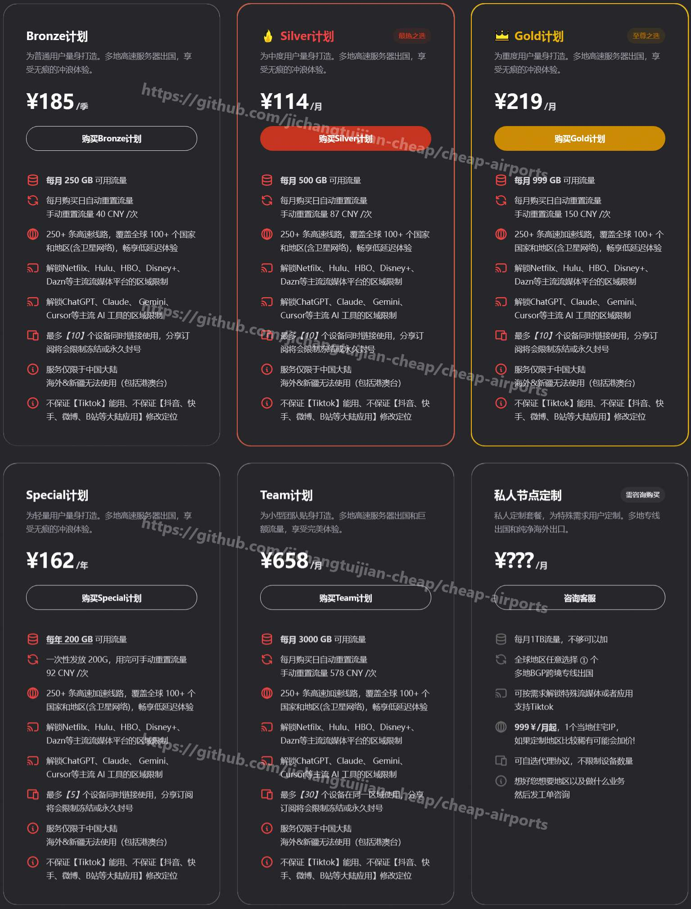

测速

### 悦通

最低价套餐：59.9元/年,200G/月（平均5元/月）送Emby，14.9元/月 1000g

特点：
* 送Emby
* 签到送流量
* 顶级专线资源的“降维打击”：不同于市面上的普通公网中转，悦通在核心节点（港/台/日/新/美）部署了 Premium 和 专属 高端线路。
* 硬核配置：接入 HKT (香港电讯)、Hinet (台湾中华电信)、AWS 等企业级资源。
* 体验：超低延迟，极强抗干扰，晚高峰稳如老狗，直接对标一线大厂体验！
* 解锁 Netflix、YouTube、TikTok、OpenAI 等主流服务
* 支持的地区包括：香港、台湾、🇯🇵 日本、🇰🇷 韩国、🇸🇬 新加坡、🇺🇸 美国、🇨🇦 加拿大、🇻🇳 越南、🇲🇾 马来西亚、🇹🇭 泰国、🇮🇳 印度、🇦🇪 阿联酋、🇪🇸 西班牙、🇸🇪 瑞典、🇳🇱 荷兰、🇩🇪 德国、🇬🇧 英国、🇷🇺 俄罗斯、🇹🇷 土耳其、🇳🇬 尼日利亚、🇧🇷 巴西、🇦🇺 澳大利亚、澳门、🇲🇳 蒙古、🇰🇭 柬埔寨、🇲🇲 缅甸、🇱🇦 老挝、🇵🇭 菲律宾、🇮🇩 印度尼西亚、🇵🇰 巴基斯坦、🇹🇱 东帝汶、🇦🇫 阿富汗、🇺🇦 乌克兰、🇻🇦 梵蒂冈、🇧🇲 百慕大、🇬🇱 格陵兰、🇦🇷 阿根廷、🇨🇺 古巴、🇪🇬 埃及、🇸🇴 索马里、🇫🇯 斐济、🇸🇧 所罗门群岛、🇬🇺 关岛、🇦🇶 南极洲…… 节点数量多、分布广，随时畅享全球高速网络！
* 379.9元终身永久不限量99T高速流量
* 599.9元终身永久不限流量，无限带宽，买断即享，彻底告别流量焦虑
* tg群人数5000+

[悦通官网](https://sink.cheapairports.dpdns.org/648txr)

套餐价格

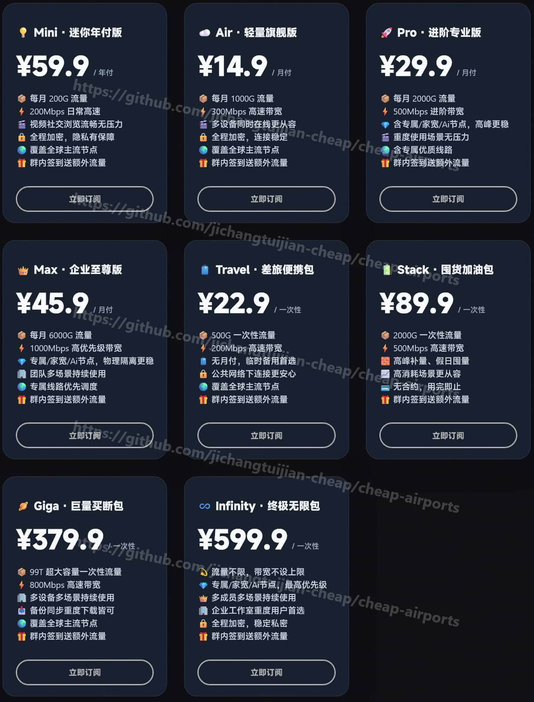

### 糯米
开业时间：2024-03-23

最低价套餐：12元/年 100G/月（平均1元/月）限时开放

特点：
* 📺解锁Netflix/Tiktok等流媒体
* 🤖️解锁ChatGPT，Copilot等
* ⚡️最高速度 1000Mbps
* ✅解锁主流常用国家地区节点，极致的性价比
* 🍎会员可使用站内提供的iOS共享账号
* ㊙️同等采用全新soga内核  极大保障数据传输安全
* ❗️此套餐不定期限时限量开放

[糯米官网](https://sink.cheapairports.dpdns.org/233sxx)

套餐价格

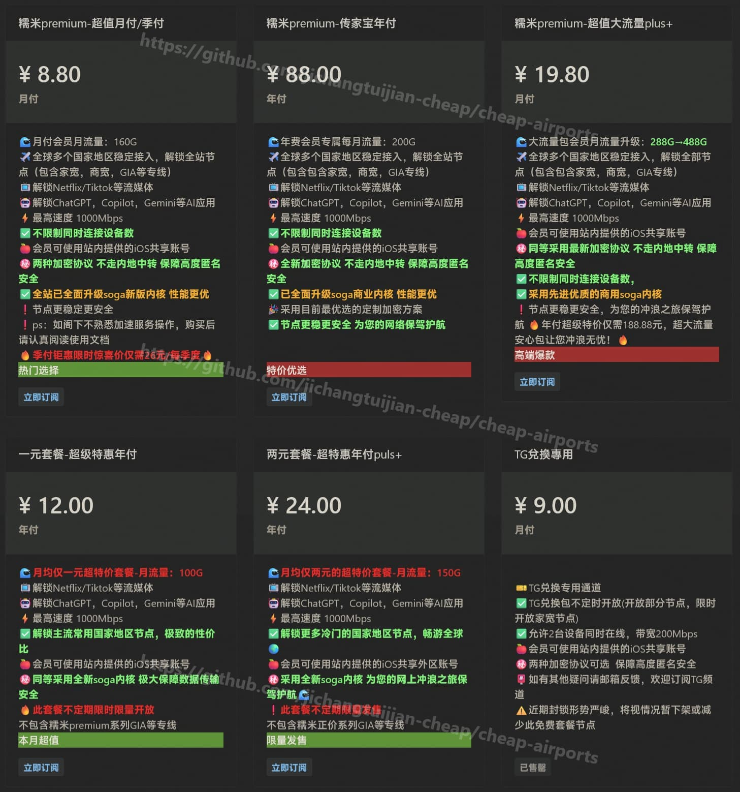

### 飞狗
开业时间：2025-01-27

最低价套餐：6元/季 100G/月（平均2元/月）

特点：
* 不限制在线客户端
* 多种协议：HY2,Vless,Anytls
* 35+节点数
* 流媒体解锁
* tg频道人数4900+

[飞狗官网](https://sink.cheapairports.dpdns.org/krj4u9)

套餐价格

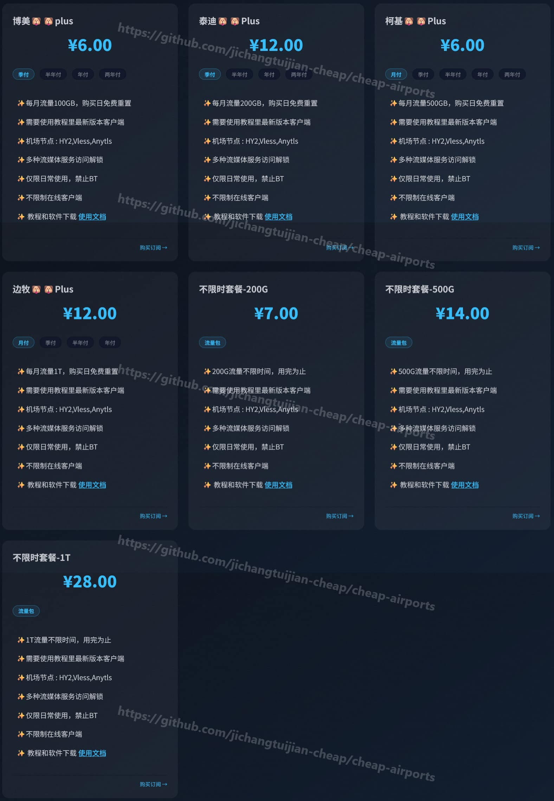

### 雪山机场

最低价套餐：39.9元/年 200G/月(平均3.3元/月), 9.9元/月 500G 送Emby

特点：
* 有家宽节点（香港，台湾，韩国等）
* 订阅任意套餐即可免费使用 Emby，支持在线观看电影、剧集、动漫等内容，手机 / 电脑 / 平板多端播放。
* 电信/联通/移动 多线接入
* 不限连接数量
* 包含原生，家宽节点
* tg频道人数9400+

[雪山机场官网](https://sink.cheapairports.dpdns.org/m82fux)

套餐价格

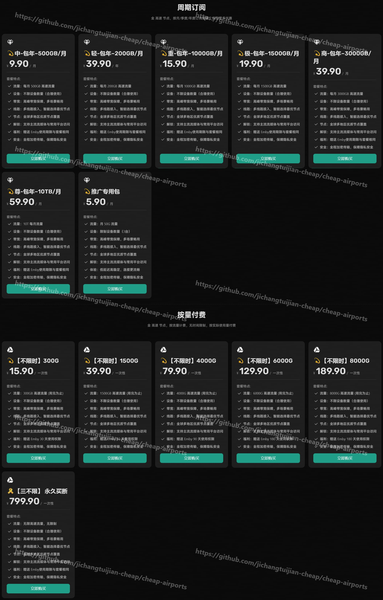

测速

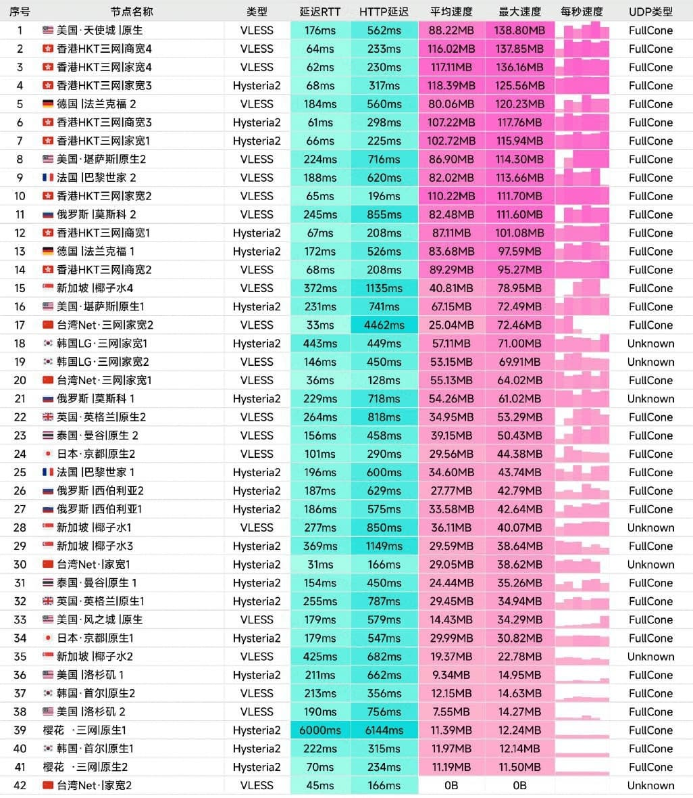

### 渔云
开业时间：2024-07-05

最低价套餐：60元/年 148G/月（平均5元/月）

特点：
* 老牌机场
* 设备：不限制，支持家庭成员共享
* 月付套餐赠送EMBY影视库
* 长期85折优惠码：且听渔吟（该优惠码可循环，不适用于年付套餐）
* tg群人数9800+

[渔云官网](https://sink.cheapairports.dpdns.org/7rkg4k)

套餐价格

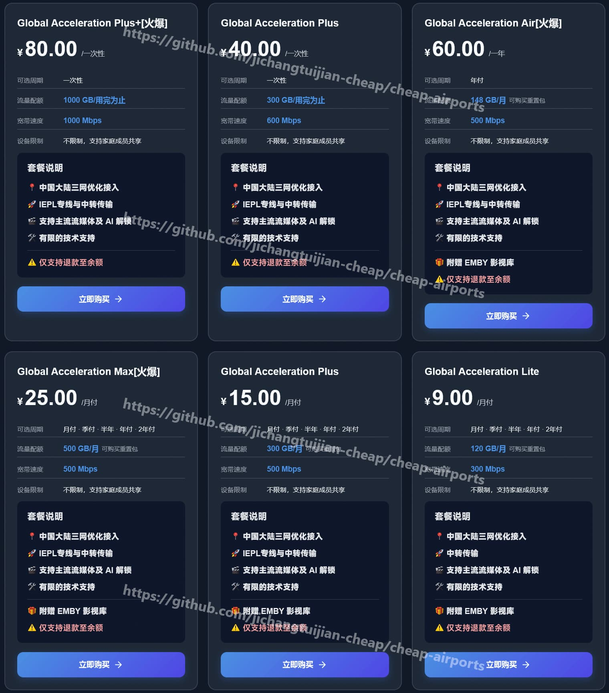

测速

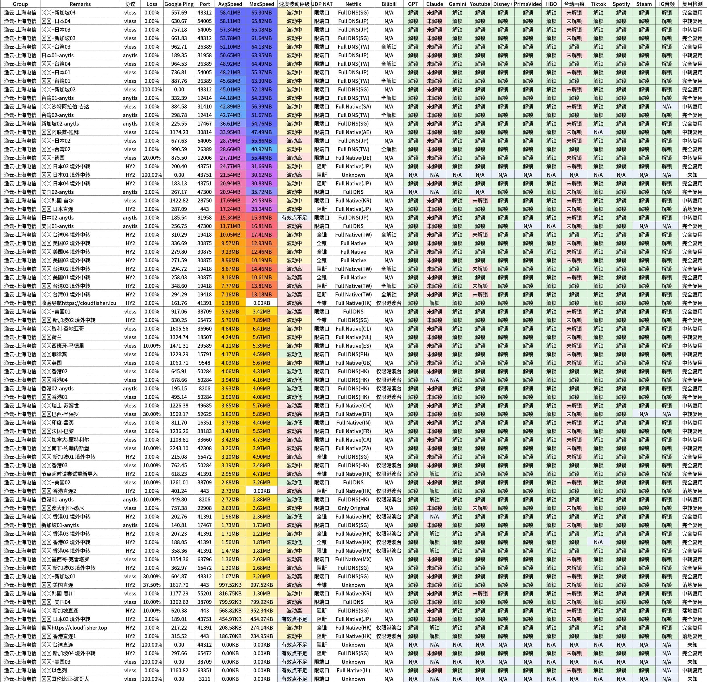

### 星链机场
开业时间：2025-08-26

最低价套餐：9.9元/年 300G/月（平均0.82元/月）

特点：
* 支持 流媒体稳定解锁
* 多国节点，节点数量最少30~40个
* tg群人数11000+

[星链机场官网](https://sink.cheapairports.dpdns.org/3h2qg2)

套餐价格

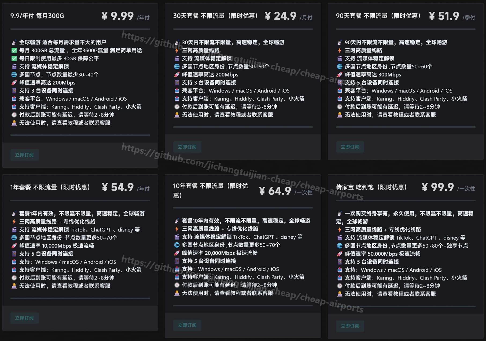

### 狗子云
开业时间：2025-07-10

最低价套餐：3元/月 168G/月

特点：
* 提供HKT、HiNet动态住宅IP
* 不限速
* 0.1 倍率节点 · 下载/观影更安心
* 支持解锁 OpenAI、Pornhub、Gemini、Netflix、TikTok、YouTube、Steam、Google Play、Spotify、Disney+、TVB、港澳台 bilibili

[狗子云官网](https://sink.cheapairports.dpdns.org/xhjy5m)

套餐价格

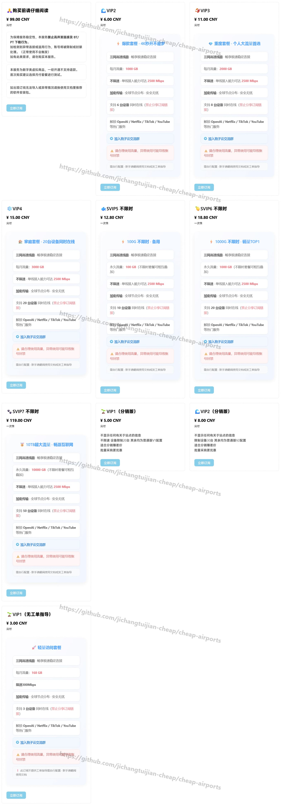

### 一分机场
开业时间：2023-02-01

最低价套餐：2元/月 100G/月

特点：
* 提供三网高质量线路
* 线路带宽最高速度20000Mbps
* 全线路安全加密,保护隐私安全
* tg群人数28000+

[一分机场官网](https://sink.cheapairports.dpdns.org/6ba6cf)

套餐价格

### 蜜雪冰城
开业时间：2025-08-27

最低价套餐：3元/月 100G/月

特点：
* 有公益套餐
* Netfilx/Hulu/Hbo/Disney+/Dazn等流媒体

[蜜雪冰城官网](https://sink.cheapairports.dpdns.org/hwm7wr)

套餐价格

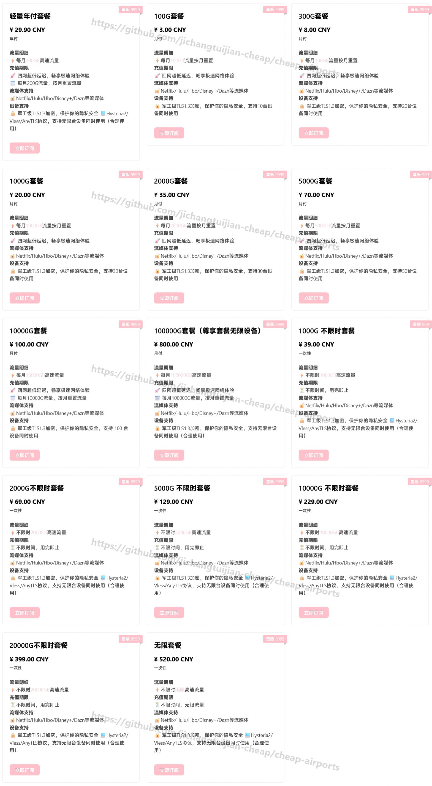

测速

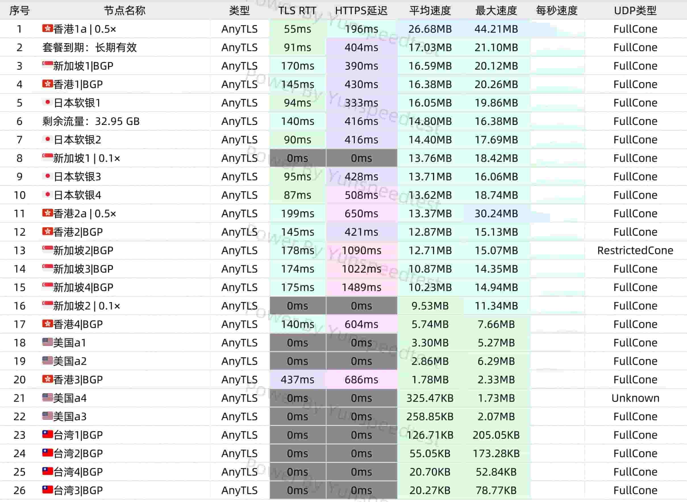

### 便宜机场

最低价套餐：13元/年 100G/月（平均1.08元/月）

特点：
* 关注频道每个月领取套餐，TG频道人数21000+
* 新用户免费试用 3 天
* 不限设备数
* 不限网速

[便宜机场官网](https://sink.cheapairports.dpdns.org/f2j64s)

套餐价格

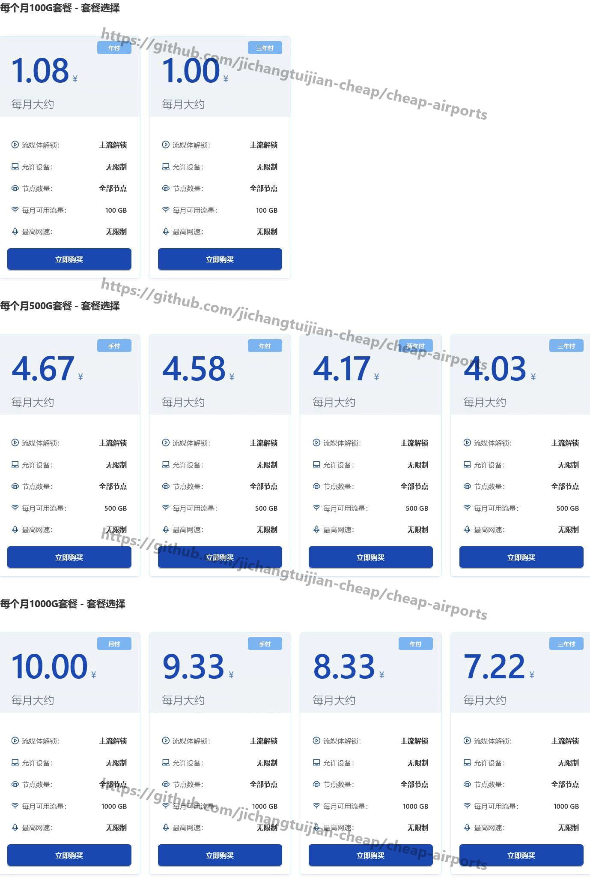

<table>
  <thead>
    <tr>
      <th align="center" style="height: 150px;">
        <a href="./articles/payy/payy.md">           
          Payy卡 
          免费无门槛Visa卡
        </a>
      </th>
      <th align="center" style="height: 150px;">
        <a href="https://sink.cheapairports.dpdns.org/gptgod-online">           
          GPT-GOD AI API 中转站 
          每天签到领2000积分，满足日常免费使用
        </a>
      </th>
      <th align="center" style="height: 150px;">
        <a href="https://sink.cheapairports.dpdns.org/yunwu">           
          云雾 API 中转站 
          全网最低价，0.5元充值1⚡️，可签到
        </a>
      </th>
    </tr>
  </thead>
</table>

## Star History

<a href="https://www.star-history.com/?repos=jichangtuijian-cheap%2Fcheap-airports&type=date&logscale=&legend=top-left">
 <picture>
   <source media="(prefers-color-scheme: dark)" srcset="https://api.star-history.com/chart?repos=jichangtuijian-cheap/cheap-airports&type=date&theme=dark&logscale&legend=top-left" />
   <source media="(prefers-color-scheme: light)" srcset="https://api.star-history.com/chart?repos=jichangtuijian-cheap/cheap-airports&type=date&logscale&legend=top-left" />
   
 </picture>
</a>