# 2026年最新 便宜机场 低价机场 划算机场 平价机场 白嫖机场 免费机场 性价比机场 只收录最低套餐价格月付或平均月付5元以内的机场

<table>
  <thead>
    <tr>
      <th align="center" style="height: 150px;">
        <a href="./articles/payy/payy.md">          <br>
          <sub>Payy卡</sub><br>
          <sub>免费无门槛Visa卡</sub>
        </a>
      </th>
      <th align="center" style="height: 150px;">
        <a href="https://sink.cheapairports.dpdns.org/gptgod-online">          <br>
          <sub>GPT-GOD AI API 中转站</sub><br>
          <sub>每天签到领2000积分，满足日常免费使用</sub>
        </a>
      </th>
      <th align="center" style="height: 150px;">
        <a href="https://sink.cheapairports.dpdns.org/yunwu">          <br>
          <sub>云雾 API 中转站</sub><br>
          <sub>全网最低价，0.5元充值1⚡️，可签到</sub>
        </a>
      </th>
    </tr>
  </thead>
</table>


| 序号 | 机场名（点击跳转详情） | 官网 | 最低价套餐 |
| -------- | -------- | -------- | -------- |
| 1    | [悦通](#悦通) | [官网](https://sink.cheapairports.dpdns.org/648txr) | 49.9元/年,200G/月(平均4.15元/月),送Emby |
| 2    | [糯米](#糯米) | [官网](https://sink.cheapairports.dpdns.org/233sxx) | 12元/年,100G/月(平均1元/月),含家宽,商宽,GIA等专线|
| 3    | [雪山机场](#雪山机场) | [官网](https://sink.cheapairports.dpdns.org/m82fux) | 39.9元/年,200G/月(平均3.3元/月),送Emby,含家宽节点 |
| 4    | [星链机场](#星链机场) | [官网](https://sink.cheapairports.dpdns.org/3h2qg2) | 9.9元/年 300G/月（平均0.82元/月） |
| 5    | [蜜雪冰城](#蜜雪冰城) | [官网](https://sink.cheapairports.dpdns.org/hwm7wr) | 3元/月 100G/月 |
| 6    | [狗子云](#狗子云) | [官网](https://sink.cheapairports.dpdns.org/xhjy5m) | 3元/月 168G/月,含动态住宅IP |
| 7    | [一分机场](#一分机场) | [官网](https://sink.cheapairports.dpdns.org/6ba6cf) | 2元/月 100G/月 |
| 8    | [良心云](#良心云) | [官网](https://sink.cheapairports.dpdns.org/zxrc3d) | 2元/月 100G/月，4元/月 500G |
| 9    | [ASA加速器](#asa加速器) | [官网](https://sink.cheapairports.dpdns.org/wck92u) | 5元/月 400G/月,30元/年2T（平均2.5元/月） |
| 10   | [赔钱机场](#赔钱机场) | [官网](https://sink.cheapairports.dpdns.org/zwp49s) | 1.5元/月 100G/月，2.99元/月 500G |
| 11   | [一元中转](#一元中转) | [官网](https://sink.cheapairports.dpdns.org/7s3tb6) | 12元/年 50G/月（平均1元/月） |
| 12   | [果粒橙](#果粒橙) | [官网](https://sink.cheapairports.dpdns.org/6bqxq7) | 5元/月 1T/月 |
| 13   | [渔云](#渔云) | [官网](https://sink.cheapairports.dpdns.org/7rkg4k) | 60元/年 148G/月（平均5元/月）,送Emby |
| 14   | [acyun](#acyun) | [官网](https://sink.cheapairports.dpdns.org/6rzq4p) | 5元/月 300G |
| 15   | [SKY VPN](#sky-vpn) | [官网](https://sink.cheapairports.dpdns.org/5ad9zr) | 0.5元/月 30G/月，4元/月 200G |
| 16   | [云鸟Loon](#云鸟loon) | [官网](https://sink.cheapairports.dpdns.org/8qrcge) | 15.9元/年 100G/月（平均1.32元/月） |
| 17   | [水牛云](#水牛云) | [官网](https://sink.cheapairports.dpdns.org/uv6ate) | 18.8元/年 100G/月（平均1.56元/月） |
| 18   | [鸡场](#鸡场) | [官网](https://sink.cheapairports.dpdns.org/e6vz65) | 18.8元/年 100G/月（平均1.56元/月）有免费套餐，可以白嫖 |
| 19   | [NetAccelera](#NetAccelera) | [官网](https://sink.cheapairports.dpdns.org/23mzmc) | 5元/月 188G |
| 20   | [橘色云](#橘色云) | [官网](https://sink.cheapairports.dpdns.org/r47das) | 11.5元/季 61G/月（平均3.83元/月） |
| 21   | [KooDog](#koodog) | [官网](https://sink.cheapairports.dpdns.org/pxnk6y) | 5元/月 35G |
| 22   | [Crush Cloud](#crush-cloud) | [官网](https://sink.cheapairports.dpdns.org/v2f6xf) | 4元/月 150G，6元/月 150G（送Emby） |
| 23   | [飞狗](#飞狗) | [官网](https://sink.cheapairports.dpdns.org/krj4u9) | 6元/季 100G/月（平均2元/月） |
| 24   | [地鼠机场](#地鼠机场) | [官网](https://sink.cheapairports.dpdns.org/54k349) | 24元/年 200G/月（平均2元/月） |
| 25   | [NPC-Cloud](#npc-cloud) | [官网](https://sink.cheapairports.dpdns.org/adgvh5) | 2.1元/月 20G，6元/月 100G |
| 26   | [惊鸿云](#惊鸿云) | [官网](https://sink.cheapairports.dpdns.org/at364s) | 5元/月 50G/月 |
| 27   | [赛博云机场](#赛博云机场) | [官网](https://sink.cheapairports.dpdns.org/hcc8v6) | 3元/月 120G/月 |
| 28   | [昆仑云](#昆仑云) | [官网](https://sink.cheapairports.dpdns.org/h4ej4v) | 3元/月 100G 含家宽节点 |
| 29   | [便宜机场](#便宜机场) | [官网](https://sink.cheapairports.dpdns.org/f2j64s) | 13元/年 100G/月（平均1.08元/月）每月发白嫖码 |

<hr>

<table>
  <thead>
    <tr>
      <th align="center" style="height: 150px;">
        <a href="./articles/payy/payy.md">          <br>
          <sub>Payy卡</sub><br>
          <sub>免费无门槛Visa卡</sub>
        </a>
      </th>
      <th align="center" style="height: 150px;">
        <a href="https://sink.cheapairports.dpdns.org/gptgod-online">          <br>
          <sub>GPT-GOD AI API 中转站</sub><br>
          <sub>每天签到领2000积分，满足日常免费使用</sub>
        </a>
      </th>
      <th align="center" style="height: 150px;">
        <a href="https://sink.cheapairports.dpdns.org/yunwu">          <br>
          <sub>云雾 API 中转站</sub><br>
          <sub>全网最低价，0.5元充值1⚡️，可签到</sub>
        </a>
      </th>
    </tr>
  </thead>
</table>

**联系我：**

Email: pianyijichang@proton.me

<hr>

### 悦通

最低价套餐：49.9元/年,200G/月（平均4.15元/月）送Emby

```
📢 悦通 520宠粉活动！

520不止有心动，还有超值优惠 ❤️
🎁 全场限时 7 折
📅 活动时间：5月18日 — 5月23日
🎟 优惠券码：YUE520
下单时输入优惠券 YUE520，即可享受全场 7折优惠！
⏰ 活动时间有限，错过再等一年～

另外由于近期上游线路、服务器、带宽资源及基础运维成本持续上涨，为了保障悦通长期稳定运营，并继续维持节点质量、线路可用性与服务体验，将对现有套餐价格进行调整。

⏰ 调整时间
2026 年 6 月 1 日 00:00 起

📌 调整内容
悦通全线套餐将在当前价格基础上统一上调 15%。
```

特点：
* 签到送流量
* 顶级专线资源的“降维打击”：不同于市面上的普通公网中转，悦通在核心节点（港/台/日/新/美）部署了 Premium 和 专属 高端线路。
* 硬核配置：接入 HKT (香港电讯)、Hinet (台湾中华电信)、AWS 等企业级资源。
* 体验：超低延迟，极强抗干扰，晚高峰稳如老狗，直接对标一线大厂体验！
* 送Emby
* 解锁 Netflix、YouTube、TikTok、OpenAI 等主流服务
* 支持的地区包括：香港、台湾、🇯🇵 日本、🇰🇷 韩国、🇸🇬 新加坡、🇺🇸 美国、🇨🇦 加拿大、🇻🇳 越南、🇲🇾 马来西亚、🇹🇭 泰国、🇮🇳 印度、🇦🇪 阿联酋、🇪🇸 西班牙、🇸🇪 瑞典、🇳🇱 荷兰、🇩🇪 德国、🇬🇧 英国、🇷🇺 俄罗斯、🇹🇷 土耳其、🇳🇬 尼日利亚、🇧🇷 巴西、🇦🇺 澳大利亚、澳门、🇲🇳 蒙古、🇰🇭 柬埔寨、🇲🇲 缅甸、🇱🇦 老挝、🇵🇭 菲律宾、🇮🇩 印度尼西亚、🇵🇰 巴基斯坦、🇹🇱 东帝汶、🇦🇫 阿富汗、🇺🇦 乌克兰、🇻🇦 梵蒂冈、🇧🇲 百慕大、🇬🇱 格陵兰、🇦🇷 阿根廷、🇨🇺 古巴、🇪🇬 埃及、🇸🇴 索马里、🇫🇯 斐济、🇸🇧 所罗门群岛、🇬🇺 关岛、🇦🇶 南极洲…… 节点数量多、分布广，随时畅享全球高速网络！
* 328元终身永久不限量99T高速流量
* 520元终身永久不限流量，无限带宽，买断即享，彻底告别流量焦虑
* tg群人数4800+

[悦通官网](https://sink.cheapairports.dpdns.org/648txr)
<details>
<summary>套餐价格</summary>


</details>

<hr>

### 糯米
开业时间：2024-03-23

最低价套餐：12元/年 100G/月（平均1元/月）限时开放

特点：
* 📺解锁Netflix/Tiktok等流媒体
* 🤖️解锁ChatGPT，Copilot等
* ⚡️最高速度 1000Mbps
* ✅解锁主流常用国家地区节点，极致的性价比
* 🍎会员可使用站内提供的iOS共享账号
* ㊙️同等采用全新soga内核  极大保障数据传输安全
* ❗️此套餐不定期限时限量开放

[糯米官网](https://sink.cheapairports.dpdns.org/233sxx)
<details>
<summary>套餐价格</summary>


</details>

<hr>

### 雪山机场

最低价套餐：39.9元/年 200G/月（平均3.3元/月）送Emby

特点：
* 有家宽节点（香港，台湾，韩国等）
* 订阅任意套餐即可免费使用 Emby，支持在线观看电影、剧集、动漫等内容，手机 / 电脑 / 平板多端播放。
* 电信/联通/移动 多线接入
* 不限连接数量
* 包含原生，家宽节点

[雪山机场官网](https://sink.cheapairports.dpdns.org/m82fux)
<details>
<summary>套餐价格</summary>


</details>
<details>
<summary>测速</summary>


</details>

<hr>

### 星链机场
开业时间：2025-08-26

最低价套餐：9.9元/年 300G/月（平均0.82元/月）

特点：
* 支持 流媒体稳定解锁
* 多国节点，节点数量最少30~40个
* tg群人数11000+

[星链机场官网](https://sink.cheapairports.dpdns.org/3h2qg2)
<details>
<summary>套餐价格</summary>


</details>

<hr>

### 蜜雪冰城
开业时间：2025-08-27

最低价套餐：3元/月 100G/月

特点：
* 有公益套餐
* Netfilx/Hulu/Hbo/Disney+/Dazn等流媒体

[蜜雪冰城官网](https://sink.cheapairports.dpdns.org/hwm7wr)
<details>
<summary>套餐价格</summary>


</details>
<hr>

### 狗子云
开业时间：2025-07-10

最低价套餐：3元/月 168G/月

特点：
* 提供HKT、HiNet动态住宅IP
* 不限速
* 0.1 倍率节点 · 下载/观影更安心
* 支持解锁 OpenAI、Pornhub、Gemini、Netflix、TikTok、YouTube、Steam、Google Play、Spotify、Disney+、TVB、港澳台 bilibili

[狗子云官网](https://sink.cheapairports.dpdns.org/xhjy5m)
<details>
<summary>套餐价格</summary>


</details>

<hr>

### 一分机场
开业时间：2023-02-01

最低价套餐：2元/月 100G/月

特点：
* 提供三网高质量线路
* 线路带宽最高速度20000Mbps
* 全线路安全加密,保护隐私安全

[一分机场官网](https://sink.cheapairports.dpdns.org/6ba6cf)
<details>
<summary>套餐价格</summary>


</details>

<hr>

### 良心云
开业时间：2025-03-20

最低价套餐：2元/月 100G/月，4元/月 500G

特点：
* 支持新疆，河南，福建，用户使用
* 无限制使用行为，无存储节点日志

[良心云官网](https://sink.cheapairports.dpdns.org/zxrc3d)
<details>
<summary>套餐价格</summary>

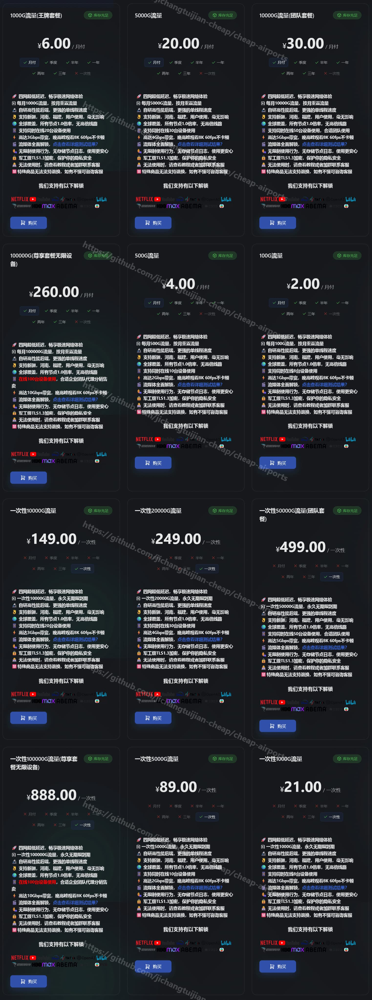

</details>
<hr>

### ASA加速器

最低价套餐：5元/月 400G/月,30元/年2T（平均2.5元/月）

特点：
* 流媒体解锁好
* 30+节点可用

[ASA加速器官网](https://sink.cheapairports.dpdns.org/wck92u)
<details>
<summary>套餐价格</summary>

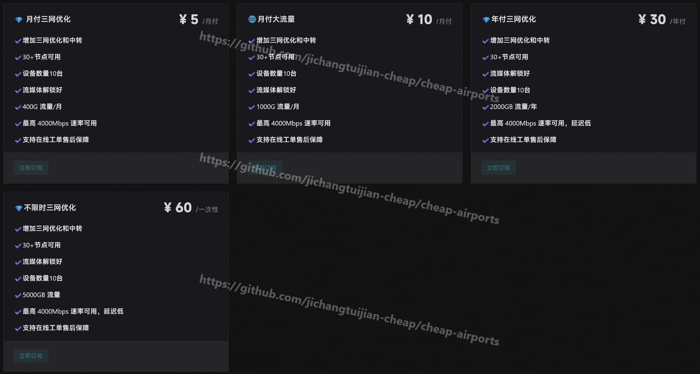

</details>

<hr>

### 赔钱机场
开业时间：2022-11-22

最低价套餐：1.5元/月 100G，2.99元/月 500G

特点：
* 不限速
* 包含0.1倍率低扣费福利下载节点
* 稳定解锁流媒体奈菲、迪士尼、TikTok、ChatGPT 等

[赔钱机场官网](https://sink.cheapairports.dpdns.org/zwp49s)
<details>
<summary>套餐价格</summary>

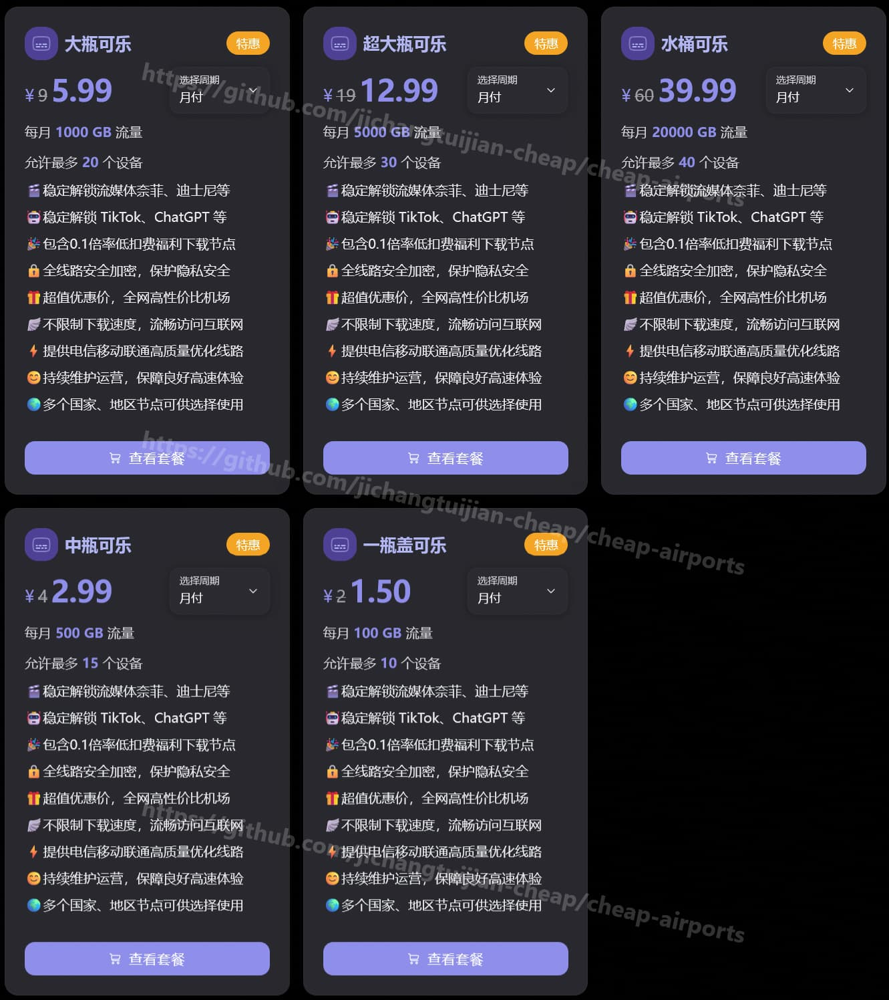

</details>

<hr>

### 一元中转
开业时间：2025-03-01

最低价套餐：12元/年 50G/月（平均1元/月）

[一元中转官网](https://sink.cheapairports.dpdns.org/7s3tb6)
<details>
<summary>套餐价格</summary>

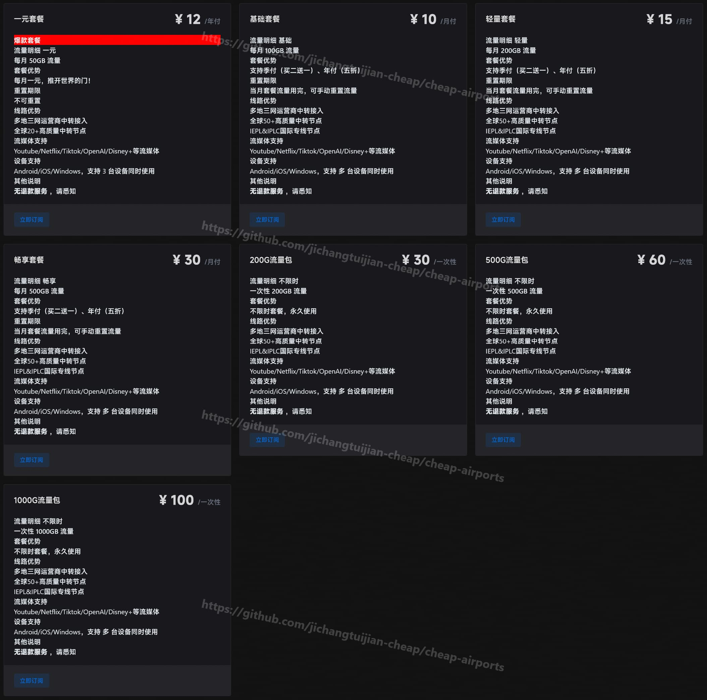

</details>

<hr>

### 果粒橙
开业时间：2022-03-19

最低价套餐：5元/月 1T/月

特点：
* 🔗最高10Gbps网络带宽
* 🔍Vless协议
* ✔️纯直连线路全1倍率
* 📺Netflix&&BiliBili&&Disney解锁
* 📱无限制设备，无限速

[果粒橙官网](https://sink.cheapairports.dpdns.org/6bqxq7)
<details>
<summary>套餐价格</summary>

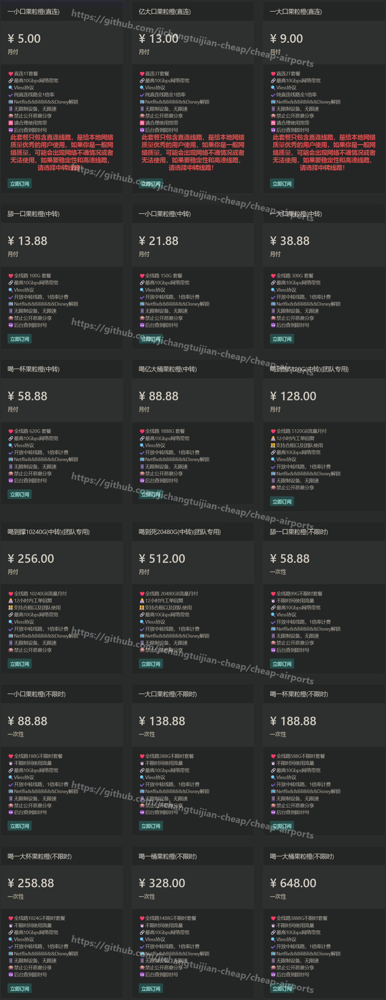

</details>

<hr>

### 渔云
开业时间：2024-07-05

最低价套餐：60元/年 148G/月（平均5元/月）

特点：
* 设备：不限制，支持家庭成员共享
* 月付套餐赠送EMBY影视库
* 长期85折优惠码：且听渔吟（该优惠码可循环，不适用于年付套餐）
* 老牌机场，tg群人数9700+

[渔云官网](https://sink.cheapairports.dpdns.org/7rkg4k)
<details>
<summary>套餐价格</summary>


</details>

<hr>

### acyun
开业时间：2023-03-10

最低价套餐：5元/月 300G
推荐购买长期订阅更加划算，季付优惠码：wCRKdpMi 年付优惠码：FGHSlLtK

特点：
* 冷门地区
* 0倍率福利下载节点
* 探针：https://jj.acyun.eu.org

[acyun官网](https://sink.cheapairports.dpdns.org/6rzq4p)
<details>
<summary>套餐价格</summary>

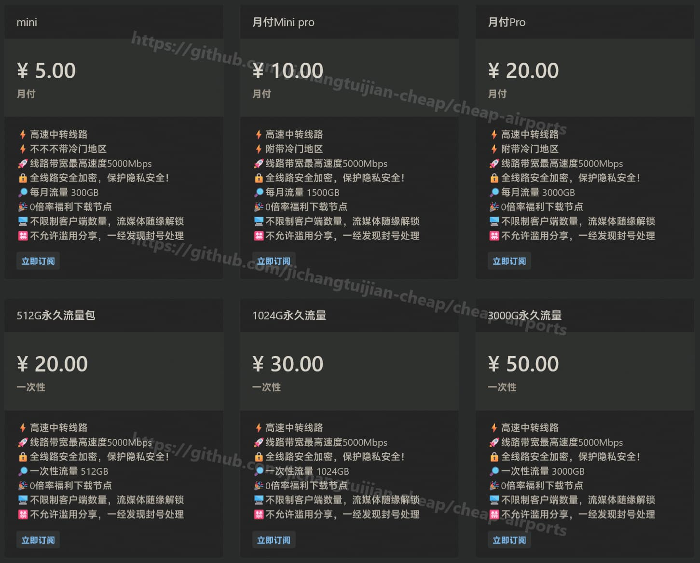

</details>

<hr>

### SKY VPN
开业时间：2021-10-05

最低价套餐：0.5元/月 30G/月，4元/月 200G（每天签到零流量）

特点：
* 免流节点

[SKY VPN官网](https://sink.cheapairports.dpdns.org/5ad9zr)
<details>
<summary>套餐价格</summary>


</details>

<hr>

### 云鸟Loon
开业时间：2024-05-02

最低价套餐：15.9元/年 100G/月（平均1.32元/月）
能白嫖，进官方Tg群获取“白嫖码”，4个节点 

特点：
* 直连机场
* 全球多个国家/地区，60+ 节点

[云鸟Loon官网](https://sink.cheapairports.dpdns.org/8qrcge)
<details>
<summary>套餐价格</summary>

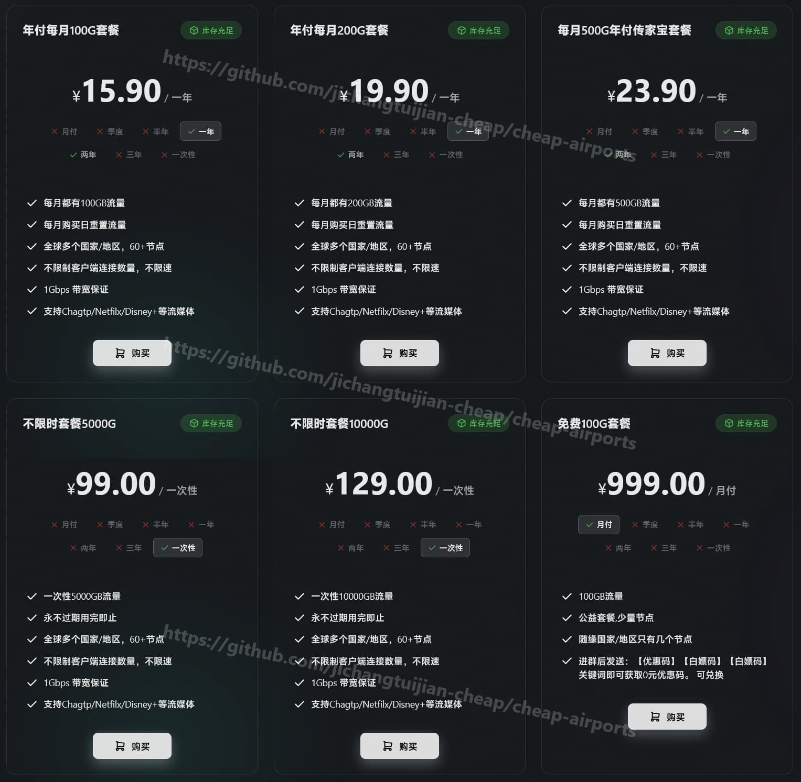

</details>

<hr>

### 水牛云
开业时间：2024-08-19

最低价套餐：18.8元/年 100G/月（平均1.56元/月）

特点：
* 直连机场
* 不限在线设备
* 可用线路50+条以上

[水牛云官网](https://sink.cheapairports.dpdns.org/uv6ate)
<details>
<summary>套餐价格</summary>

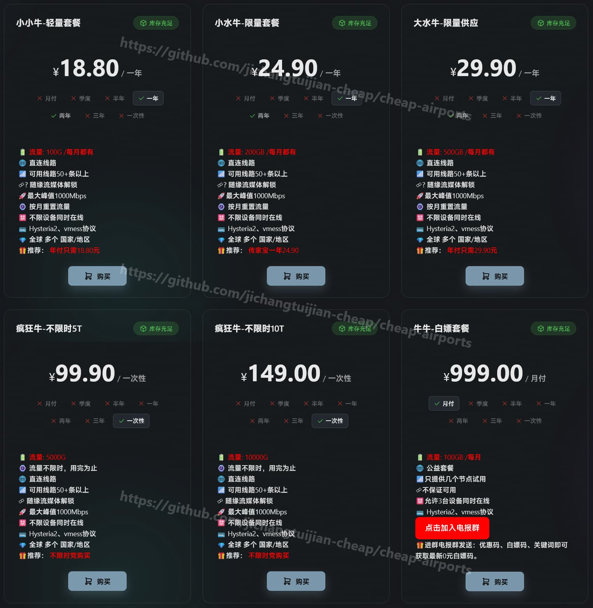

</details>

<hr>

### 鸡场
开业时间：2025-04-27

最低价套餐：18.8元/年 100G/月（平均1.56元/月）

特点：
* 有免费套餐，可以白嫖
* 不限设备数
* 50+节点

[鸡场官网](https://sink.cheapairports.dpdns.org/e6vz65)
<details>
<summary>套餐价格</summary>

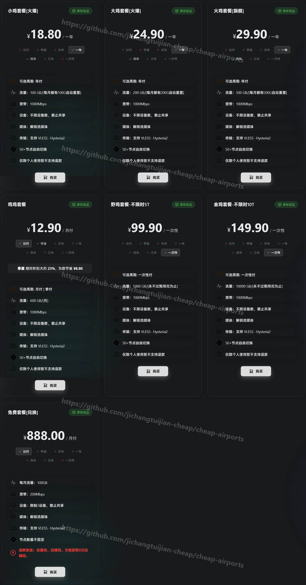

</details>

<hr>

### NetAccelera
开业时间：2025-04-09

最低价套餐：5元/月 188G

特点：
* 30+国家 60+节点
* 解锁：Netflix、ChatGPT
* 不限速，不限连接数

[NetAccelera官网](https://sink.cheapairports.dpdns.org/23mzmc)
<details>
<summary>套餐价格</summary>

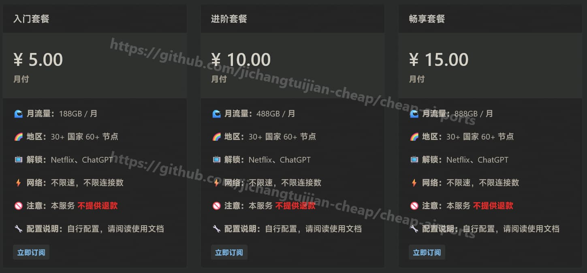

</details>

<hr>

### 橘色云
开业时间：2024-01-26

最低价套餐：11.5元/季 61G/月（平均3.83元/月）

特点：
* 全中转线路
* 不限制设备数

[橘色云官网](https://sink.cheapairports.dpdns.org/r47das)
<details>
<summary>套餐价格</summary>

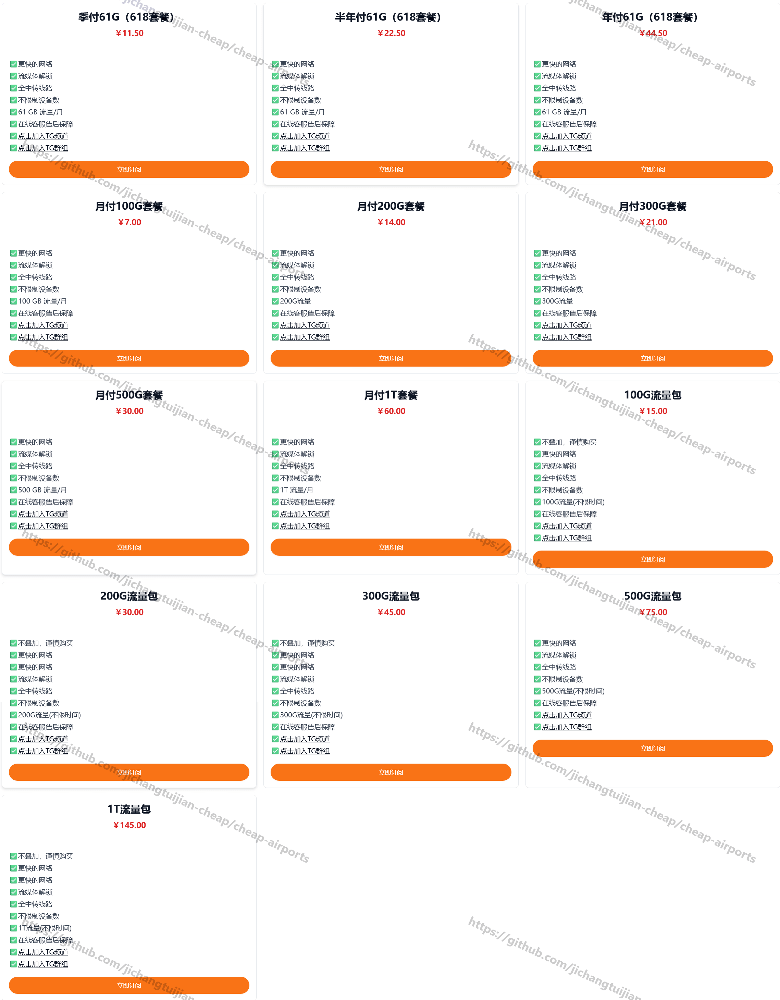

</details>

<hr>

### KooDog
开业时间：2024-06-27

最低价套餐：5元/月 35G

特点：
* 三网 IEPL 专线
* 奈飞|Porn|Prime免登入观影
* 闲暇时段低倍率计费

[KooDog官网](https://sink.cheapairports.dpdns.org/pxnk6y)
<details>
<summary>套餐价格</summary>


</details>
<details>
<summary>测速</summary>


</details>

<hr>

### Crush Cloud
开业时间：2025-08-19

最低价套餐：4元/月 150G；6元/月 150G（送Emby）

特点：
* **仅支持IPv6**
* 不限速
* 不限设备

[Crush Cloud](https://sink.cheapairports.dpdns.org/v2f6xf)
<details>
<summary>套餐价格</summary>


</details>
<details>
<summary>测速</summary>


</details>

<hr>

### 飞狗
开业时间：2025-01-27

最低价套餐：6元/季 100G/月（平均2元/月）

[飞狗官网](https://sink.cheapairports.dpdns.org/krj4u9)
<details>
<summary>套餐价格</summary>


</details>

<hr>

### 地鼠机场
开业时间：2024-08-19

最低价套餐：24元/年 100G/月（平均2元/月）

特点：
* 无使用限制，你可以随意使用bt等工具
* 无审计规则，我们不会限制你访问任何网站
* 无日志记录，我们不会记录任何的节点日志
* 每月一杯柠檬水的价格
* 最高4gbps速率，节点均为G口

[地鼠机场官网](https://sink.cheapairports.dpdns.org/54k349)
<details>
<summary>套餐价格</summary>

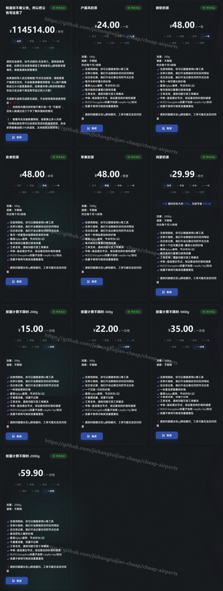

</details>
<details>
<summary>测速</summary>


</details>

<hr>

### NPC-Cloud
开业时间：2025-04-06

最低价套餐：2.1元/月 20G，6元/月 100G

特点：
* IEPL×中转×直连×BGP 四链融合 超稳定
* 覆盖全球20+地区，约70个节点可选择
* 全线路覆盖：家宽、原生、冷门节点

[NPC-Cloud官网](https://sink.cheapairports.dpdns.org/adgvh5)
<details>
<summary>套餐价格</summary>

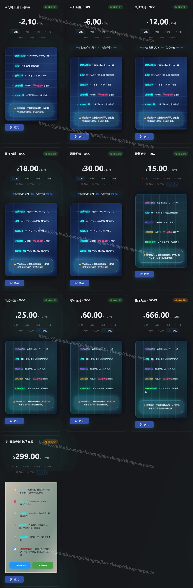

</details>
<details>
<summary>测速</summary>


</details>

<hr>

### 惊鸿云
开业时间：2025-06-13

最低价套餐：5元/月 50G/月

特点：
* 货真价实的iepl专线+电信入口
* 日本、韩国、美国、英国、新加坡等地高质量节点

[惊鸿云官网](https://sink.cheapairports.dpdns.org/at364s)
<details>
<summary>套餐价格</summary>


</details>

<hr>

### 赛博云机场
开业时间：2025-03-01

最低价套餐：3元/月 120G/月

特点：
* 可以免费使用
* 节点地区：日本|新加坡|韩国|台湾|马来西亚|泰国|越南|印尼|印度|澳门|美国|加拿大|英国|荷兰|德国|法国|西班牙|瑞典|芬兰|爱尔兰|澳大利亚|土耳其|埃及|俄罗斯|乌克兰|哈萨克斯坦|孟加拉国|罗马尼亚|南非
* 家宽节点

[赛博云机场官网](https://sink.cheapairports.dpdns.org/hcc8v6)
<details>
<summary>套餐价格</summary>


</details>

<hr>

### 昆仑云

最低价套餐：3元/月 100G 含家宽节点

特点：
* 含家宽节点
* 全直连线路：无中转节点，延迟更低、速度更快
* 智能负载均衡：自动分配最优线路，提升高峰期稳定性

[昆仑云官网](https://sink.cheapairports.dpdns.org/h4ej4v)
<details>
<summary>套餐价格</summary>

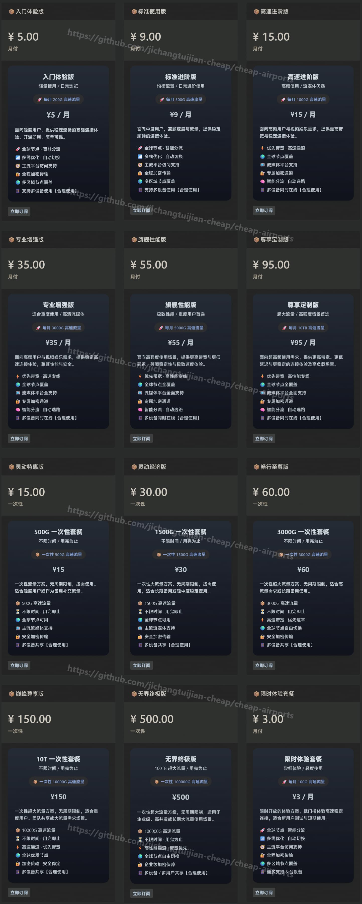

</details>
<hr>

### 便宜机场

最低价套餐：13元/年 100G/月（平均1.08元/月）每月发白嫖码

特点：
* 关注频道每个月领取套餐，TG频道人数21000+
* 新用户免费试用 3 天
* 不限设备数
* 不限网速

[便宜机场官网](https://sink.cheapairports.dpdns.org/f2j64s)
<details>
<summary>套餐价格</summary>


</details>

<hr>

<table>
  <thead>
    <tr>
      <th align="center" style="height: 150px;">
        <a href="./articles/payy/payy.md">          <br>
          <sub>Payy卡</sub><br>
          <sub>免费无门槛Visa卡</sub>
        </a>
      </th>
      <th align="center" style="height: 150px;">
        <a href="https://sink.cheapairports.dpdns.org/gptgod-online">          <br>
          <sub>GPT-GOD AI API 中转站</sub><br>
          <sub>每天签到领2000积分，满足日常免费使用</sub>
        </a>
      </th>
      <th align="center" style="height: 150px;">
        <a href="https://sink.cheapairports.dpdns.org/yunwu">          <br>
          <sub>云雾 API 中转站</sub><br>
          <sub>全网最低价，0.5元充值1⚡️，可签到</sub>
        </a>
      </th>
    </tr>
  </thead>
</table>

## Star History

<a href="https://www.star-history.com/#jichangtuijian-cheap/cheap-airports&Date">
 <picture>
   <source media="(prefers-color-scheme: dark)" srcset="https://api.star-history.com/svg?repos=jichangtuijian-cheap/cheap-airports&type=Date&theme=dark" />
   <source media="(prefers-color-scheme: light)" srcset="https://api.star-history.com/svg?repos=jichangtuijian-cheap/cheap-airports&type=Date" />
   
 </picture>
</a>