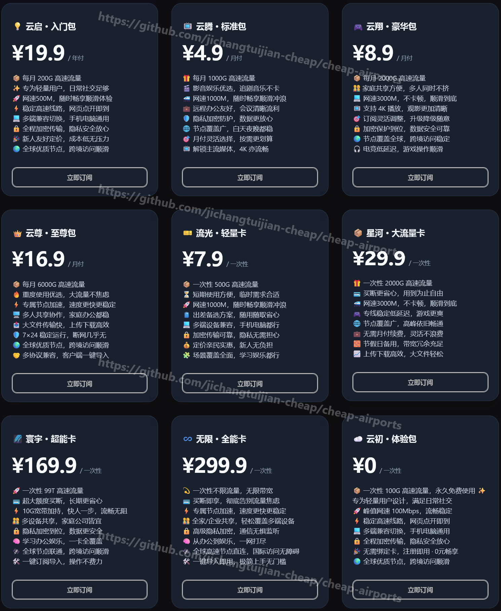
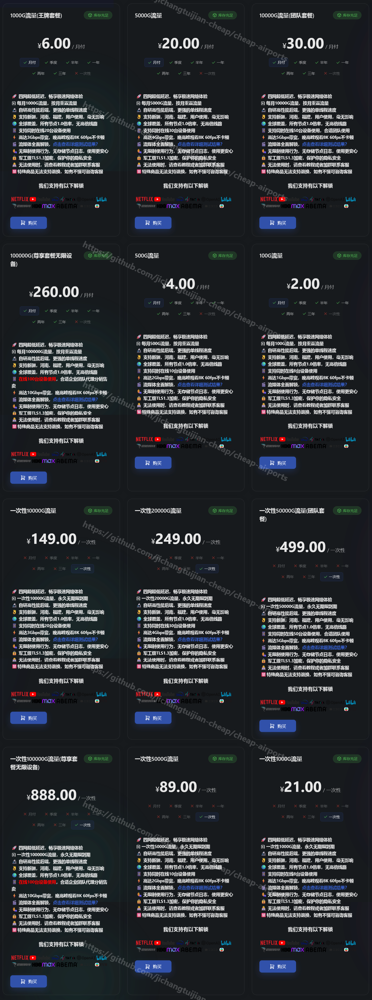
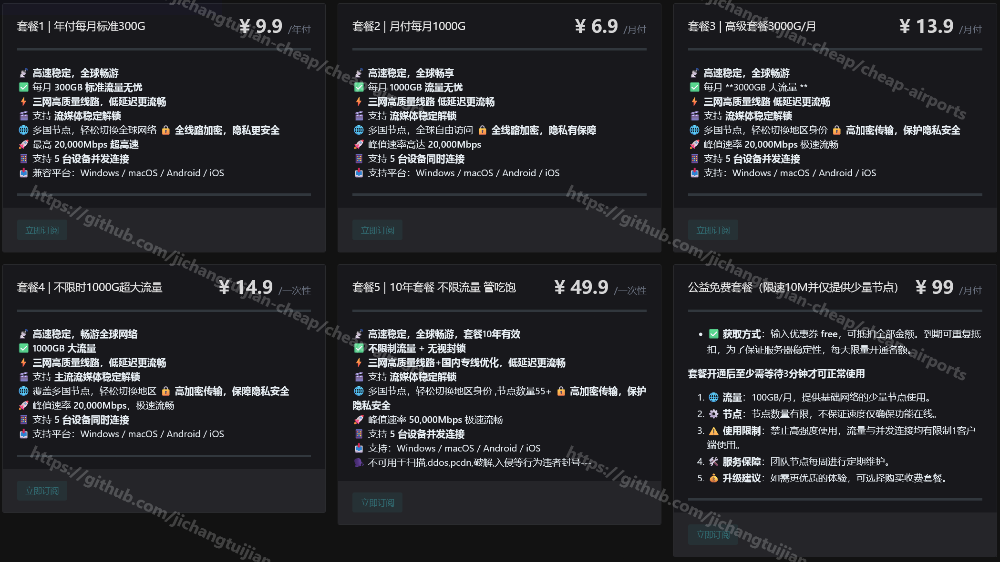
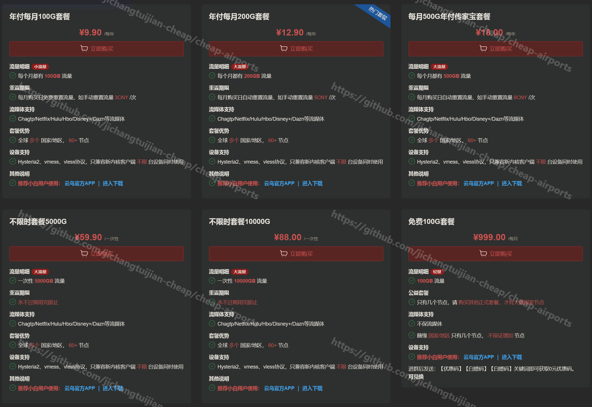
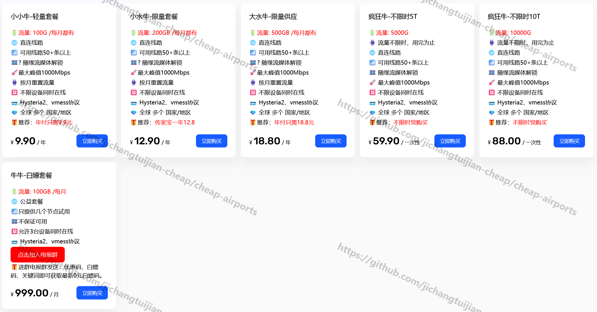
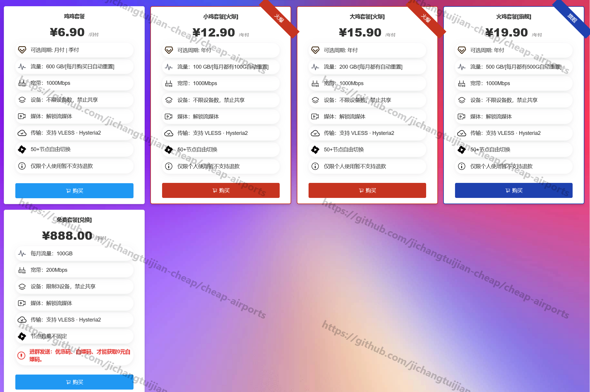
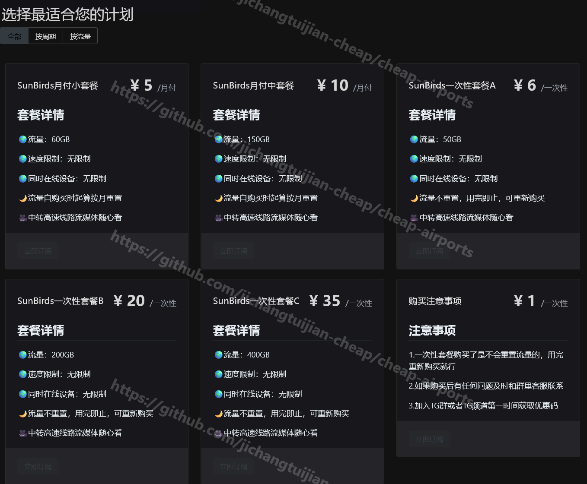
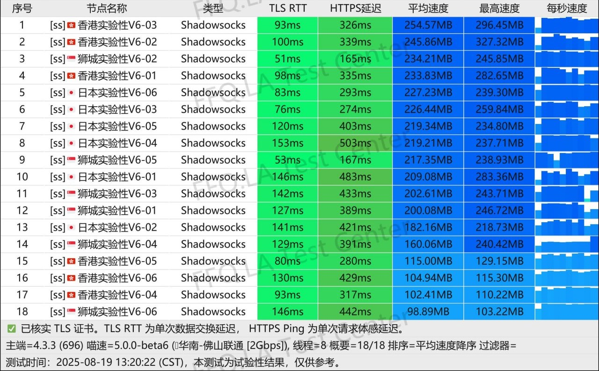
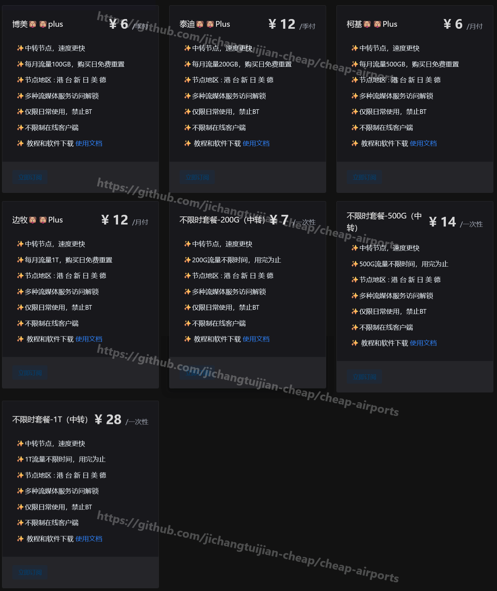
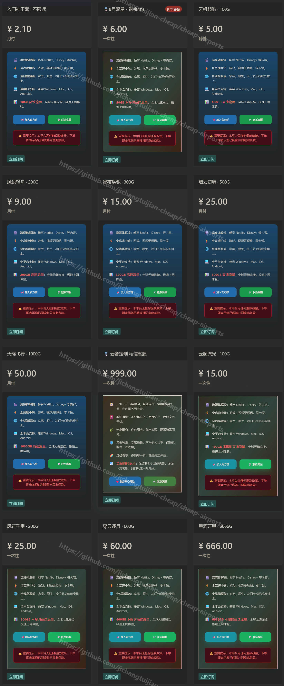

# 便宜机场 低价机场 划算机场 平价机场 白嫖机场 只收录最低套餐价格月付或平均月付5元以内的机场

|||
|:----------------------------------:|:----------------------------------:|
| [📈 跟单一个月+20%，普通人不会交易也能稳定盈利](./articles/hyperx/hyperx.md) |  |
| [💵 普通人小本金怎么通过币圈年入20w+](./articles/crypto/makesomecoins.md) |  |
| [💳 5分钟无门槛获取Visa卡，可绑定微信支付宝，可以兑换实体卡](./articles/payy/payy.md) |  |

| 序号 | 机场名（点击跳转详情） | 官网 | 最低价套餐 |
| -------- | -------- | -------- | -------- |
| 1  | [悦通](#悦通) | [官网](https://sink.cheapairports.dpdns.org/648txr) | 45.9元/年,200G/月(平均3.8元/月),送Emby |
| 2  | [雪山机场](#雪山机场) | [官网](https://sink.cheapairports.dpdns.org/m82fux) | 29.9元/年,200G/月(平均2.5元/月),送Emby,含家宽节点 |
| 3  | [一分机场](#一分机场) | [官网](https://sink.cheapairports.dpdns.org/6ba6cf) | 2元/月 100G/月 |
| 4  | [流量光机场](#流量光机场) | [官网](https://sink.cheapairports.dpdns.org/rsjxqm) | 40元/年,60G/月（平均3.3元/月） |
| 5  | [克拉云机场](#克拉云机场) | [官网](https://sink.cheapairports.dpdns.org/mpxtbd) | 2元/月 1T/月,5元/月 5T/月,10元 1T（不限时） |
| 6  | [acyun](#acyun) | [官网](https://sink.cheapairports.dpdns.org/6rzq4p) | 3元/月 300G |
| 7  | [糯米](#糯米) | [官网](https://sink.cheapairports.dpdns.org/233sxx) | 12元/年 100G/月（平均1元/月）|
| 8  | [可爱多](#可爱多) | [官网](https://sink.cheapairports.dpdns.org/hwm7wr) | 2元/月 100G/月 |
| 9  | [顶级机场](#顶级机场) | [官网](https://sink.cheapairports.dpdns.org/t6am4v) | 15.6元/年 200G/月（平均1.3元/月） |
| 10 | [狗子云](#狗子云) | [官网](https://sink.cheapairports.dpdns.org/xhjy5m) | 2.6元/月 200G/月,含家宽节点 |
| 11 | [良心云](#良心云) | [官网](https://sink.cheapairports.dpdns.org/zxrc3d) | 2元/月 100G/月，4元/月 500G |
| 12 | [ASA加速器](#asa加速器) | [官网](https://sink.cheapairports.dpdns.org/wck92u) | 2元/月 100G/月,30元/年2T（平均2.5元/月） |
| 13 | [赔钱机场](#赔钱机场) | [官网](https://sink.cheapairports.dpdns.org/zwp49s) | 1.5元/月 100G/月，2.99元/月 500G |
| 14 | [一元中转](#一元中转) | [官网](https://sink.cheapairports.dpdns.org/7s3tb6) | 12元/年 50G/月（平均1元/月） |
| 15 | [SRCloud](#SRCloud) | [官网](https://sink.cheapairports.dpdns.org/6dpnrh) | 3元/月 50G |
| 16 | [白嫖机场](#白嫖机场) | [官网](https://sink.cheapairports.dpdns.org/xyt5j3) | 19元/年 1T/月（平均1.58元/月） |
| 17 | [Kitty Network](#kitty-network) | [官网](https://sink.cheapairports.dpdns.org/nrdjeu) | 24元/年 128G/月（平均2元/月） |
| 18 | [一毛机场](#一毛机场) | [官网](https://sink.cheapairports.dpdns.org/jddwtu) | 1元/月 100G，3元/月 500G |
| 19 | [早安云](#早安云) | [官网](https://sink.cheapairports.dpdns.org/xsuq7m) | 1元/月 100G，2元/月 500G，3元/月 1T |
| 20 | [果粒橙](#果粒橙) | [官网](https://sink.cheapairports.dpdns.org/6bqxq7) | 5元/月 1T/月 |
| 21 | [渔云](#渔云) | [官网](https://sink.cheapairports.dpdns.org/7rkg4k) | 60元/年 148G/月（平均5元/月）,送Emby |
| 22 | [星链机场](#星链机场) | [官网](https://sink.cheapairports.dpdns.org/3h2qg2) | 9.9元/年 300G/月（平均0.82元/月） |
| 23 | [无觅云](#无觅云) | [官网](https://sink.cheapairports.dpdns.org/5tkdkc) | 券后23.92元/年 300G/年（平均2元/月）|
| 24 | [SKY VPN](#sky-vpn) | [官网](https://sink.cheapairports.dpdns.org/5ad9zr) | 0.5元/月 30G/月，4元/月 200G |
| 25 | [云鸟Loon](#云鸟loon) | [官网](https://sink.cheapairports.dpdns.org/8qrcge) | 12.9元/年 100G/月（平均1.08元/月） |
| 26 | [水牛云](#水牛云) | [官网](https://sink.cheapairports.dpdns.org/uv6ate) | 15.9元/年 100G/月（平均1.33元/月） |
| 27 | [鸡场](#鸡场) | [官网](https://sink.cheapairports.dpdns.org/e6vz65) | 15.9元/年 100G/月（平均1.33元/月） |
| 28 | [NetAccelera](#NetAccelera) | [官网](https://sink.cheapairports.dpdns.org/23mzmc) | 1元/月 18G，5元/月 188G |
| 29 | [太阳鸟](#太阳鸟) | [官网](https://sink.cheapairports.dpdns.org/9ee2tu) | 5元/月 60G |
| 30 | [冲上云霄](#冲上云霄) | [官网](https://sink.cheapairports.dpdns.org/p5m39v) | 5元/月 80G |
| 31 | [橘色云](#橘色云) | [官网](https://sink.cheapairports.dpdns.org/r47das) | 11.5元/季 61G/月（平均3.83元/月） |
| 32 | [KooDog](#koodog) | [官网](https://sink.cheapairports.dpdns.org/pxnk6y) | 5元/月 35G |
| 33 | [Crush Cloud](#crush-cloud) | [官网](https://sink.cheapairports.dpdns.org/v2f6xf) | 4元/月 150G |
| 34 | [飞狗](#飞狗) | [官网](https://sink.cheapairports.dpdns.org/krj4u9) | 6元/季 100G/月（平均2元/月） |
| 35 | [地鼠机场](#地鼠机场) | [官网](https://sink.cheapairports.dpdns.org/54k349) | 48元/年 200G/月（平均4元/月） |
| 36 | [NPC-Cloud](#npc-cloud) | [官网](https://sink.cheapairports.dpdns.org/adgvh5) | 2.1元/月 20G，6元/月 100G |
| 37 | [惊鸿云](#惊鸿云) | [官网](https://sink.cheapairports.dpdns.org/at364s) | 5元/月 50G/月 |
| 38 | [Neko Cloud](#neko-cloud) | [官网](https://sink.cheapairports.dpdns.org/q7v894) | 24元/年 128G/月（平均2元/月） |
| 39 | [赛博云机场](#赛博云机场) | [官网](https://sink.cheapairports.dpdns.org/hcc8v6) | 3元/月 120G/月 |
| 40 | [能用](#能用) | [官网](https://sink.cheapairports.dpdns.org/nmpxz4) | 3元/月 30G |
| 41 | [源哥3r中转机场](#源哥3r中转机场) | [官网](https://sink.cheapairports.dpdns.org/e8dzbf) | 3元/月 40G/月 |
| 42 | [云际节点](#云际节点) | [官网](https://sink.cheapairports.dpdns.org/uhzrar) | 2.9元/月 600G/月 |
| 43 | [昆仑云](#昆仑云) | [官网](https://sink.cheapairports.dpdns.org/h4ej4v) | 3元/月 200G 含家宽节点 |

<a href="./articles/hyperx/hyperx.md" style="color:sky; font-weight:bold; text-decoration:underline; font-size:16px;">
  📈 跟单一个月+20%，普通人不会交易也能稳定盈利
</a>

<a href="./articles/crypto/makesomecoins.md" style="color:green; font-weight:bold; text-decoration:underline; font-size:16px;">
  💵 普通人小本金怎么通过币圈年入20w+，点击查看教程
</a>

<a href="./articles/payy/payy.md" style="color:orange; font-weight:bold; text-decoration:underline; font-size:16px;">
  💳 5分钟无门槛获取Visa卡，可绑定微信支付宝，可以兑换实体卡，点击查看教程
</a>

**联系我：**

Email: pianyijichang@proton.me

### 悦通

最低价套餐：45.9元/年,200G/月（平均3.8元/月）送Emby；月付9.9元/月 1T/月

特点：
* 顶级专线资源的“降维打击”：不同于市面上的普通公网中转，悦通在核心节点（港/台/日/新/美）部署了 Premium 和 专属 高端线路。
* 硬核配置：接入 HKT (香港电讯)、Hinet (台湾中华电信)、AWS 等企业级资源。
* 体验：超低延迟，极强抗干扰，晚高峰稳如老狗，直接对标一线大厂体验！
* 送Emby
* 解锁 Netflix、YouTube、TikTok、OpenAI 等主流服务
* 支持的地区包括：香港、台湾、🇯🇵 日本、🇰🇷 韩国、🇸🇬 新加坡、🇺🇸 美国、🇨🇦 加拿大、🇻🇳 越南、🇲🇾 马来西亚、🇹🇭 泰国、🇮🇳 印度、🇦🇪 阿联酋、🇪🇸 西班牙、🇸🇪 瑞典、🇳🇱 荷兰、🇩🇪 德国、🇬🇧 英国、🇷🇺 俄罗斯、🇹🇷 土耳其、🇳🇬 尼日利亚、🇧🇷 巴西、🇦🇺 澳大利亚、澳门、🇲🇳 蒙古、🇰🇭 柬埔寨、🇲🇲 缅甸、🇱🇦 老挝、🇵🇭 菲律宾、🇮🇩 印度尼西亚、🇵🇰 巴基斯坦、🇹🇱 东帝汶、🇦🇫 阿富汗、🇺🇦 乌克兰、🇻🇦 梵蒂冈、🇧🇲 百慕大、🇬🇱 格陵兰、🇦🇷 阿根廷、🇨🇺 古巴、🇪🇬 埃及、🇸🇴 索马里、🇫🇯 斐济、🇸🇧 所罗门群岛、🇬🇺 关岛、🇦🇶 南极洲…… 节点数量多、分布广，随时畅享全球高速网络！
* 259.9元终身永久不限量99T高速流量
* 409.9元终身永久不限流量，无限带宽，买断即享，彻底告别流量焦虑
* tg群人数2000+

[悦通官网](https://sink.cheapairports.dpdns.org/648txr)

套餐价格

### 雪山机场

最低价套餐：30元/年 200G/月（平均2.5元/月）送Emby

特点：
* 有家宽节点（香港，台湾，韩国等）
* 订阅任意套餐即可免费使用 Emby，支持在线观看电影、剧集、动漫等内容，手机 / 电脑 / 平板多端播放。
* 电信/联通/移动 多线接入
* 不限连接数量
* 包含原生，家宽节点

[雪山机场官网](https://sink.cheapairports.dpdns.org/m82fux)

套餐价格

测速

### 一分机场
开业时间：2023-02-01

最低价套餐：2元/月 100G/月

特点：
* 不限设备数

[一分机场官网](https://sink.cheapairports.dpdns.org/6ba6cf)

套餐价格

### 流量光机场
开业时间：2024-06-21

最低价套餐：40元/年,60G/月（平均3.3元/月）

特点：
* 不限制设备数，不限速
* 最高倍率: x1 （专线除外，直连节点0倍率）
* 国内高质高速中转入口 高质三网独立BGP国际IEPL

[流量光机场官网](https://sink.cheapairports.dpdns.org/rsjxqm)

套餐价格

### 克拉云机场

套餐：2元/月 1T/月，5元/月 5T/月，10元 1T（不限时）

特点：
* 不限制客户端连接数，不限速
* 三网运营商高质量线路
* tg群人数3900+
* 购买王者套餐的用户可额外获取专属vip线路特权，除了默认的直连，还有顶级中转线路，提供双重保障

[克拉云机场官网](https://sink.cheapairports.dpdns.org/mpxtbd)

套餐价格

### acyun
开业时间：2023-03-10

最低价套餐：3元/月 300G
推荐购买长期订阅更加划算，季付优惠码：wCRKdpMi 年付优惠码：FGHSlLtK

特点：
* 冷门地区
* 0倍率福利下载节点
* 探针：https://jj.acyun.eu.org

[acyun官网](https://sink.cheapairports.dpdns.org/6rzq4p)

套餐价格

### 糯米
开业时间：2024-03-23

最低价套餐：12元/年 100G/月（平均1元/月）限时开放

特点：
* 📺解锁Netflix/Tiktok等流媒体
* 🤖️解锁ChatGPT，Copilot等
* ⚡️最高速度 1000Mbps  
* ✅解锁主流常用国家地区节点，极致的性价比
* 🍎会员可使用站内提供的iOS共享账号
* ㊙️同等采用全新soga内核  极大保障数据传输安全
* ❗️此套餐不定期限时限量开放

[糯米官网](https://sink.cheapairports.dpdns.org/233sxx)

套餐价格

### 可爱多
开业时间：2025-08-27

最低价套餐：2元/月 100G/月，公益套餐，加入群组可领取白嫖码

特点：
* 有公益套餐
* Netfilx/Hulu/Hbo/Disney+/Dazn等流媒体

[可爱多官网](https://sink.cheapairports.dpdns.org/hwm7wr)

套餐价格

### 顶级机场

最低价套餐：15.6元/年 200G/月（平均1.3元/月）

特点：
* 不限制客户端数量
* 总线路接入100Gbps以上带宽 

[顶级机场官网](https://sink.cheapairports.dpdns.org/t6am4v)

套餐价格

### 狗子云
开业时间：2025-07-10

最低价套餐：2.6元/月 200G/月

特点：
* 提供原生IP，动态家宽支持
* 不限速
* 0.1 倍率节点 · 下载/观影更安心
* 解锁 OpenAI / Netflix / TikTok / YouTube 等热门服务 

[狗子云官网](https://sink.cheapairports.dpdns.org/xhjy5m)

套餐价格

### 良心云
开业时间：2025-03-20

最低价套餐：2元/月 100G/月，4元/月 500G

特点：
* 支持新疆，河南，福建，用户使用
* 无限制使用行为，无存储节点日志

[良心云官网](https://sink.cheapairports.dpdns.org/zxrc3d)

套餐价格

### ASA加速器

最低价套餐：2元/月 100G/月,30元/年2T（平均2.5元/月）

特点：
* 流媒体解锁好

[ASA加速器官网](https://sink.cheapairports.dpdns.org/wck92u)

套餐价格

### 赔钱机场
开业时间：2022-11-22

最低价套餐：1.5元/月 100G，2.99元/月 500G

特点：
* 不限速
* 包含0.1倍率低扣费福利下载节点
* 稳定解锁流媒体奈菲、迪士尼、TikTok、ChatGPT 等

[赔钱机场官网](https://sink.cheapairports.dpdns.org/zwp49s)

套餐价格

### 一元中转
开业时间：2025-03-01

最低价套餐：12元/年 50G/月（平均1元/月）

[一元中转官网](https://sink.cheapairports.dpdns.org/7s3tb6)

套餐价格

### SRCloud
开业时间：2025-03-31

最低价套餐：3元/月 50G

特点：
* 可以群内签到白嫖
* 不限速

[SRCloud官网](https://sink.cheapairports.dpdns.org/6dpnrh)

套餐价格

### 白嫖机场
开业时间：2022-12-28

最低价套餐：19元/年 1T/月（平均1.58元/月）

特点：
* 不限设备数 不限速
* 急速稳定 CN2+BGP专线
* 全球拥有超过50+优质线路节点
* 提供Vmess Trojan SS 多种协议供客户选择 含ipv6节点且支持修改host进行免流
* 运营团队在意大利米兰

[白嫖机场官网](https://sink.cheapairports.dpdns.org/xyt5j3)

套餐价格

### Kitty Network
开业时间：2024-09-18

最低价套餐：24元/年 128G/月（平均2元/月）

特点：
* * tg频道人数28000+
* 不限速，不限在线设备数量
* 解锁 Netflix，Disney+，ChatGPT等

[Kitty Network官网](https://sink.cheapairports.dpdns.org/nrdjeu)

套餐价格

### 一毛机场
开业时间：2023-09-20

最低价套餐：1元/月 100G，3元/月 500G

特点：
* 不限制速度，支持无限设备同时使用
* 解锁ChatGPT/奈飞/迪士尼等

[一毛机场官网](https://sink.cheapairports.dpdns.org/jddwtu)

套餐价格

测速

### 早安云
开业时间：2024-09-14

最低价套餐：1元/月 100G，2元/月 500G，3元/月 1T

特点：
* 不限访问速度
* 不限制设备数量和每日用量
* 完善的御三家解锁

[早安云官网](https://sink.cheapairports.dpdns.org/xsuq7m)

套餐价格

测速

### 果粒橙
开业时间：2022-03-19

最低价套餐：5元/月 1T/月

特点：
* 🔗最高10Gbps网络带宽
* 🔍Vless协议
* ✔️纯直连线路全1倍率
* 📺Netflix&&BiliBili&&Disney解锁
* 📱无限制设备，无限速

[果粒橙官网](https://sink.cheapairports.dpdns.org/6bqxq7)

套餐价格

### 渔云
开业时间：2024-07-05

最低价套餐：60元/年 148G/月（平均5元/月）

特点：
* 设备：不限制，支持家庭成员共享
* 月付套餐赠送EMBY影视库
* 长期85折优惠码：且听渔吟（该优惠码可循环，不适用于年付套餐）
* 老牌机场，tg群人数8500+

[渔云官网](https://sink.cheapairports.dpdns.org/7rkg4k)

套餐价格

### 星链机场
开业时间：2025-08-26

最低价套餐：9.9元/年 300G/月（平均0.82元/月）

特点：
* 全场5~7折随机优惠券: rXRW47o8
* 有公益免费套餐 100GB/月

[星链机场官网](https://sink.cheapairports.dpdns.org/3h2qg2)

套餐价格

### 无觅云
开业时间：2024-05-12

最低价套餐：29.90元/年 300G/年（平均2.5元/月），八折优惠码：8080，优惠后平均2元/月

特点：
* 支持抖音/快手等国内APP改IP
* 全球 15+国家/地区， 40+节点
* 单节点最高 5000Mbps 带宽可用
* 多地BGP隧道加密中转，高SLA保证

[无觅云官网](https://sink.cheapairports.dpdns.org/5tkdkc)

套餐价格

### SKY VPN
开业时间：2021-10-05

最低价套餐：0.5元/月 30G/月，4元/月 200G

特点：
* 免流节点

[SKY VPN官网](https://sink.cheapairports.dpdns.org/5ad9zr)

套餐价格

### 云鸟Loon
开业时间：2024-05-02

最低价套餐：12.9元/年 100G/月（平均1.08元/月）
能白嫖，进官方Tg群获取“白嫖码”，4个节点 

免费节点

特点：
* 直连机场
* 全球多个国家/地区，60+ 节点

[云鸟Loon官网](https://sink.cheapairports.dpdns.org/8qrcge)

套餐价格

### 水牛云
开业时间：2024-08-19

最低价套餐：12.9元/年 100G/月（平均1.08元/月）

特点：
* 直连机场
* 不限在线设备
* 可用线路50+条以上

[水牛云官网](https://sink.cheapairports.dpdns.org/uv6ate)

套餐价格

### 鸡场
开业时间：2025-04-27

最低价套餐：12.9元/年 100G/月（平均1.08元/月）

特点：
* 有免费套餐
* 不限设备数
* 50+节点

[鸡场官网](https://sink.cheapairports.dpdns.org/e6vz65)

套餐价格

### NetAccelera
开业时间：2025-04-09

最低价套餐：1元/月 18G，5元/月 188G

特点：
* 有防失联免费套餐
* 30+国家 60+节点
* 解锁：Netflix、ChatGPT
* 不限速，不限连接数

[NetAccelera官网](https://sink.cheapairports.dpdns.org/23mzmc)

套餐价格

### 太阳鸟
开业时间：2025-08-03

最低价套餐：5元/月 60G

特点：
* 所有节点均采用中转专线
* 无设备数限制,无晚高峰限速，无在线IP限制

[太阳鸟官网](https://sink.cheapairports.dpdns.org/9ee2tu)

套餐价格

### 冲上云霄
开业时间：2024-07-22

最低价套餐：5元/月 80G

特点：
* 家宽节点
* 流媒体解锁 & GPT不降智

[冲上云霄官网](https://sink.cheapairports.dpdns.org/p5m39v)

套餐价格

### 橘色云
开业时间：2024-01-26

最低价套餐：11.5元/季 61G/月（平均3.83元/月）

特点：
* 全中转线路
* 不限制设备数

[橘色云官网](https://sink.cheapairports.dpdns.org/r47das)

套餐价格

### KooDog
开业时间：2024-06-27

最低价套餐：5元/月 35G

特点：
* BGP跨境专线
* 奈飞|Porn|Prime免登入观影
* 闲暇时段低倍率计费

[KooDog官网](https://sink.cheapairports.dpdns.org/pxnk6y)

套餐价格

测速

### Crush Cloud
开业时间：2025-08-19

最低价套餐：4元/月 150G

特点：
* **仅支持IPv6**
* 不限速
* 不限设备

[Crush Cloud](https://sink.cheapairports.dpdns.org/v2f6xf)

套餐价格

测速

### 飞狗
开业时间：2025-01-27

最低价套餐：6元/季 100G/月（平均2元/月）

特点：
* 全直连节点
* 节点地区 : 港 台 新 日 美 德 

[飞狗官网](https://sink.cheapairports.dpdns.org/krj4u9)

套餐价格

### 地鼠机场
开业时间：2024-08-19

最低价套餐：48元/年 200G/月（平均4元/月）

特点：
* 无使用限制，你可以随意使用bt等工具
* 无审计规则，我们不会限制你访问任何网站
* 无日志记录，我们不会记录任何的节点日志
* 每月一杯柠檬水的价格
* 最高4gbps速率，节点均为G口

[地鼠机场官网](https://sink.cheapairports.dpdns.org/54k349)

套餐价格

测速

### NPC-Cloud
开业时间：2025-04-06

最低价套餐：2.1元/月 20G，6元/月 100G

特点：
* IEPL×中转×直连×BGP 四链融合 超稳定
* 覆盖全球20+地区，约70个节点可选择
* 全线路覆盖：家宽、原生、冷门节点

[NPC-Cloud官网](https://sink.cheapairports.dpdns.org/adgvh5)

套餐价格

测速

### 惊鸿云
开业时间：2025-06-13

最低价套餐：5元/月 50G/月

特点：
* 货真价实的iepl专线+电信入口
* 日本、韩国、美国、英国、新加坡等地高质量节点

[惊鸿云官网](https://sink.cheapairports.dpdns.org/at364s)

套餐价格

### Neko Cloud
开业时间：2025-08-11

最低价套餐：24元/年 128G/月（平均2元/月）

特点：
* Netfilx/Hulu/Hbo/Disney+/Dazn等流媒体

[Neko Cloud官网](https://sink.cheapairports.dpdns.org/q7v894)

套餐价格

### 赛博云机场
开业时间：2025-03-01

最低价套餐：3元/月 120G/月

特点：
* 可以免费使用
* 节点地区：日本|新加坡|韩国|台湾|马来西亚|泰国|越南|印尼|印度|澳门|美国|加拿大|英国|荷兰|德国|法国|西班牙|瑞典|芬兰|爱尔兰|澳大利亚|土耳其|埃及|俄罗斯|乌克兰|哈萨克斯坦|孟加拉国|罗马尼亚|南非
* 家宽节点

[赛博云机场官网](https://sink.cheapairports.dpdns.org/hcc8v6)

套餐价格

### 能用
开业时间：2025-06-25

最低价套餐：3元/月 30G

特点：
* 解锁: Netflix, Disney+, ChatGPT, MyTVSuper, HBO, BiliBili, Bahamut等
* 节点无审计

[能用官网](https://sink.cheapairports.dpdns.org/nmpxz4)

套餐价格

### 源哥3r中转机场
开业时间：2025-08-28

最低价套餐：3元/月 40G/月

特点：
* 同时在线设备：不限制
* 高性价比的中转线路保持速度和稳定
* 全平台通用，流媒体解锁随便看

[源哥3r中转机场官网](https://sink.cheapairports.dpdns.org/e8dzbf)

套餐价格

测速

### 云际节点

最低价套餐：2.9元/月 600G/月

特点：
* 三网专线+电信入口，峰值 1000 Mbps
* 全部解锁 Netflix、Disney+ 等

[云际节点官网](https://sink.cheapairports.dpdns.org/uhzrar)

套餐价格

### 昆仑云

最低价套餐：3元/月 200G 含家宽节点

特点：
* 含家宽节点
* 全直连线路：无中转节点，延迟更低、速度更快
* 智能负载均衡：自动分配最优线路，提升高峰期稳定性

[昆仑云官网](https://sink.cheapairports.dpdns.org/h4ej4v)

套餐价格

<a href="./articles/hyperx/hyperx.md" style="color:sky; font-weight:bold; text-decoration:underline; font-size:16px;">
  📈 跟单一个月+20%，普通人不会交易也能稳定盈利
</a>

<a href="./articles/crypto/makesomecoins.md" style="color:green; font-weight:bold; text-decoration:underline; font-size:16px;">
  💵 普通人小本金怎么通过币圈年入20w+，点击查看教程
</a>

<a href="./articles/payy/payy.md" style="color:orange; font-weight:bold; text-decoration:underline; font-size:16px;">
  💳 5分钟无门槛获取Visa卡，可绑定微信支付宝，可以兑换实体卡，点击查看教程
</a>

## Star History

<a href="https://www.star-history.com/#jichangtuijian-cheap/cheap-airports&Date">
 <picture>
   <source media="(prefers-color-scheme: dark)" srcset="https://api.star-history.com/svg?repos=jichangtuijian-cheap/cheap-airports&type=Date&theme=dark" />
   <source media="(prefers-color-scheme: light)" srcset="https://api.star-history.com/svg?repos=jichangtuijian-cheap/cheap-airports&type=Date" />
   
 </picture>
</a>