# 便宜机场 低价机场 划算机场 平价机场 白嫖机场 
# 只收录最低套餐价格月付或平均月付5元以内的机场
## 5分钟无门槛获取虚拟Visa卡，可绑定微信支付宝，[点击查看教程](./articles/payy/payy.md)
| 序号 | 机场名（点击跳转详情） | 官网 | 开业时间 | 最低价套餐 |
| -------- | -------- | -------- | -------- | -------- |
| 1  | [悦通](#悦通) | [官网](https://sink.cheapairports.dpdns.org/648txr) | 2025-09-02 | 30元/年,200G/月（平均2.5元/月）送Emby |
| 2  | [白嫖机场](#白嫖机场) | [官网](https://sink.cheapairports.dpdns.org/xyt5j3) | 2022-12-28 | 19元/年 1T/月（平均1.58元/月） |
| 3  | [Kitty Network](#kitty-network) | [官网](https://sink.cheapairports.dpdns.org/nrdjeu) | 2024-09-18 | 24元/年 128G/月（平均2元/月） |
| 4  | [雪山机场](#雪山机场) | [官网](https://sink.cheapairports.dpdns.org/m82fux) | 2025-02-14 | 30元/年,200G/月（平均2.5元/月）送Emby |
| 5  | [一毛机场](#一毛机场) | [官网](https://sink.cheapairports.dpdns.org/jddwtu) | 2023-09-20 | 1元/月 100G，3元/月 500G |
| 6  | [早安云](#早安云) | [官网](https://sink.cheapairports.dpdns.org/xsuq7m) | 2024-09-14 | 1元/月 100G，2元/月 500G，3元/月 1T |
| 7  | [一分机场](#一分机场) | [官网](https://sink.cheapairports.dpdns.org/6ba6cf) | 2023-02-01 | 2元/月 100G/月 |
| 8  | [赔钱机场](#赔钱机场) | [官网](https://sink.cheapairports.dpdns.org/zwp49s) | 2022-11-22 | 1.5元/月 100G/月，2.99元/月 500G |
| 9  | [流量光机场](#流量光机场) | [官网](https://sink.cheapairports.dpdns.org/rsjxqm) | 2024-06-21 | 4.9元/月 150G/月 |
| 10 | [渔云](#渔云) | [官网](https://sink.cheapairports.dpdns.org/7rkg4k) | 2024-07-05 | 60元/年 148G/月（平均5元/月） |
| 11 | [acyun](#acyun) | [官网](https://sink.cheapairports.dpdns.org/6rzq4p) | 2023-03-10 | 2元/月 300G |
| 12 | [星链机场](#星链机场) | [官网](https://sink.cheapairports.dpdns.org/3h2qg2) | 2025-08-26 | 9.9元/年 300G/月（平均0.82元/月） |
| 13 | [星空云](#星空云) | [官网](https://sink.cheapairports.dpdns.org/nyrfgm) | 2025-05-20 | 13元/半年 288G/月（平均2.17元/月） |
| 14 | [SRCloud](#SRCloud) | [官网](https://sink.cheapairports.dpdns.org/6dpnrh) | 2025-03-31 | 3元/月 50G |
| 15 | [良心云](#良心云) | [官网](https://sink.cheapairports.dpdns.org/zxrc3d) | 2025-03-20 | 2元/月 100G/月，4元/月 500G |
| 16 | [无觅云](#无觅云) | [官网](https://sink.cheapairports.dpdns.org/5tkdkc) | 2024-05-12 | 券后23.92元/年 300G/年（平均2元/月）|
| 17 | [奶茶](#奶茶) | [官网](https://sink.cheapairports.dpdns.org/ffpztg) | 2025-07-17 | 5元/月 无限流量 |
| 18 | [SKY VPN](#sky-vpn) | [官网](https://sink.cheapairports.dpdns.org/5ad9zr) | 2021-10-05 | 0.5元/月 30G/月，4元/月 200G |
| 19 | [迅隐云](#迅隐云) | [官网](https://sink.cheapairports.dpdns.org/48zr9f) | 2025-02-07 | 15元/季度 200G/月（平均5元/月） |
| 20 | [星港机场](#星港机场) | [官网](https://sink.cheapairports.dpdns.org/em55j7) | 2025-07-14 | 1.49元/月 200G/月 |
| 21 | [云鸟Loon](#云鸟loon) | [官网](https://sink.cheapairports.dpdns.org/8qrcge) | 2024-05-02 | 9.9元/年 100G/月（平均0.82元/月） |
| 22 | [水牛云](#水牛云) | [官网](https://sink.cheapairports.dpdns.org/uv6ate) | 2024-08-19 | 9.9元/年 100G/月（平均0.82元/月） |
| 23 | [鸡场](#鸡场) | [官网](https://sink.cheapairports.dpdns.org/e6vz65) | 2025-04-27 | 12.9元/年 100G/月（平均1.08元/月） |
| 24 | [NetAccelera](#NetAccelera) | [官网](https://sink.cheapairports.dpdns.org/23mzmc) | 2025-04-09 | 1元/月 18G，5元/月 188G |
| 25 | [太阳鸟](#太阳鸟) | [官网](https://sink.cheapairports.dpdns.org/9ee2tu) | 2025-08-03 | 5元/月 60G |
| 26 | [一元中转](#一元中转) | [官网](https://sink.cheapairports.dpdns.org/7s3tb6) | 2025-03-01 | 12元/年 50G/月（平均1元/月） |
| 27 | [冲上云霄](#冲上云霄) | [官网](https://sink.cheapairports.dpdns.org/p5m39v) | 2024-07-22 | 5元/月 80G |
| 28 | [橘色云](#橘色云) | [官网](https://sink.cheapairports.dpdns.org/r47das) | 2024-01-26 | 11.5元/季 61G/月（平均3.83元/月） |
| 29 | [KooDog](#koodog) | [官网](https://sink.cheapairports.dpdns.org/pxnk6y) | 2024-06-27 | 5元/月 30G |
| 30 | [Crush Cloud](#crush-cloud) | [官网](https://sink.cheapairports.dpdns.org/v2f6xf) | 2025-08-19 | 4元/月 150G |
| 31 | [飞狗](#飞狗) | [官网](https://sink.cheapairports.dpdns.org/krj4u9) | 2025-01-27 | 6元/年 100G/月（平均0.5元/月） |
| 32 | [地鼠机场](#地鼠机场) | [官网](https://sink.cheapairports.dpdns.org/54k349) | 2024-08-19 | 1元/月 50G，3.99元/月 200G |
| 33 | [NPC-Cloud](#npc-cloud) | [官网](https://sink.cheapairports.dpdns.org/adgvh5) | 2025-04-06 | 2.1元/月 10G，5元/月 100G |
| 34 | [惊鸿云](#惊鸿云) | [官网](https://sink.cheapairports.dpdns.org/at364s) | 2025-06-13 | 5元/月 50G/月 |
| 35 | [iNetS](#iNetS) | [官网](https://sink.cheapairports.dpdns.org/77yc73) | 2025-04-27 | 4.9元/月 50G/月 |
| 36 | [克拉云机场](#克拉云机场) | [官网](https://sink.cheapairports.dpdns.org/mpxtbd) | 2025-09-15 | 2元/月 1T/月 |
| 37 | [Neko Cloud](#neko-cloud) | [官网](https://sink.cheapairports.dpdns.org/q7v894) | 2025-08-11 | 5元/月 500G |
| 38 | [赛博云机场](#赛博云机场) | [官网](https://sink.cheapairports.dpdns.org/hcc8v6) | 2025-03-01 | 3元/月 120G/月 |
| 39 | [能用](#能用) | [官网](https://sink.cheapairports.dpdns.org/nmpxz4) | 2025-06-25 | 3元/月 30G |
| 40 | [可爱多](#可爱多) | [官网](https://sink.cheapairports.dpdns.org/hwm7wr) | 2025-08-27 | 3元/月 100G/月 |

## 5分钟无门槛获取虚拟Visa卡，可绑定微信支付宝，[点击查看教程](./articles/payy/payy.md)

**联系我：**

Email: pianyijichang@proton.me

### 悦通
开业时间：2025-09-02

最低价套餐：30元/年 200G/月（平均2.5元/月）送Emby

特点：
* 送Emby
* 全场 6 折优惠，优惠券码：悦202510，活动时间：9月28日 - 10月8日

[悦通官网](https://sink.cheapairports.dpdns.org/648txr)

套餐价格

### 白嫖机场
开业时间：2022-12-28

最低价套餐：19元/年 1T/月（平均1.58元/月）

特点：
* 不限设备数 不限速
* 急速稳定 CN2+BGP专线
* 全球拥有超过50+优质线路节点
* 提供Vmess Trojan SS 多种协议供客户选择 含ipv6节点且支持修改host进行免流
* 运营团队在意大利米兰

[白嫖机场官网](https://sink.cheapairports.dpdns.org/xyt5j3)

套餐价格

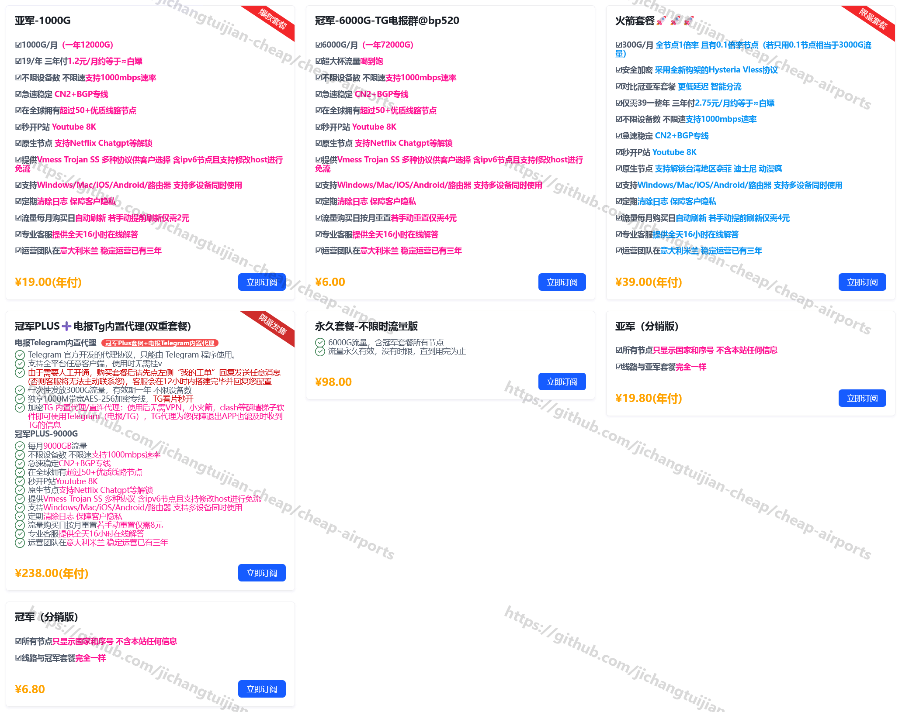

### Kitty Network
开业时间：2024-09-18

最低价套餐：24元/年 128G/月（平均2元/月）

特点：
* 不限速，不限在线设备数量
* 解锁 Netflix，Disney+，ChatGPT等

[Kitty Network官网](https://sink.cheapairports.dpdns.org/nrdjeu)

套餐价格

### 雪山机场
开业时间：2025-04-12

最低价套餐：30元/年 200G/月（平均2.5元/月）送Emby

特点：
* 订阅任意套餐即可免费使用 Emby
* 电信/联通/移动 多线接入
* 不限连接数量
* 包含原生，家宽节点

[雪山机场官网](https://sink.cheapairports.dpdns.org/m82fux)

套餐价格

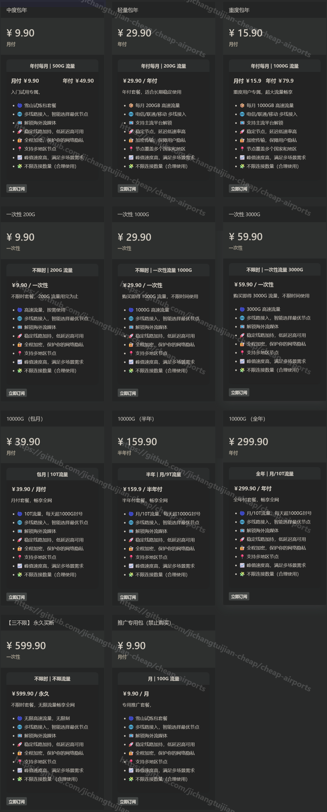

测速

### 一毛机场
开业时间：2023-09-20

最低价套餐：1元/月 100G，3元/月 500G

特点：
* 不限制速度，支持无限设备同时使用
* 解锁ChatGPT/奈飞/迪士尼等

[一毛机场官网](https://sink.cheapairports.dpdns.org/jddwtu)

套餐价格

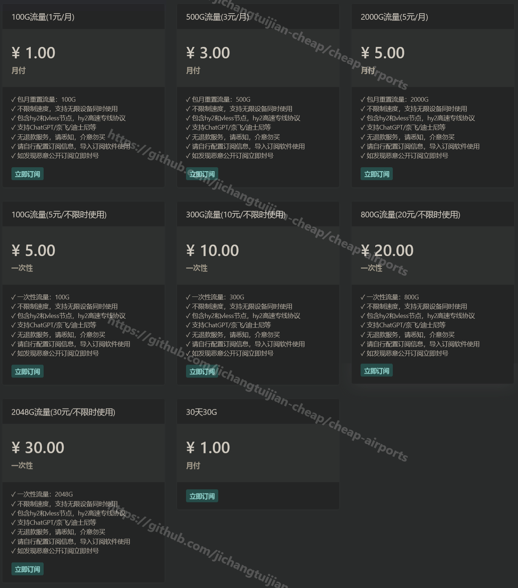

测速

### 早安云
开业时间：2024-09-14

最低价套餐：1元/月 100G，2元/月 500G，3元/月 1T

特点：
* 不限访问速度
* 不限制设备数量和每日用量
* 完善的御三家解锁

[早安云官网](https://sink.cheapairports.dpdns.org/xsuq7m)

套餐价格

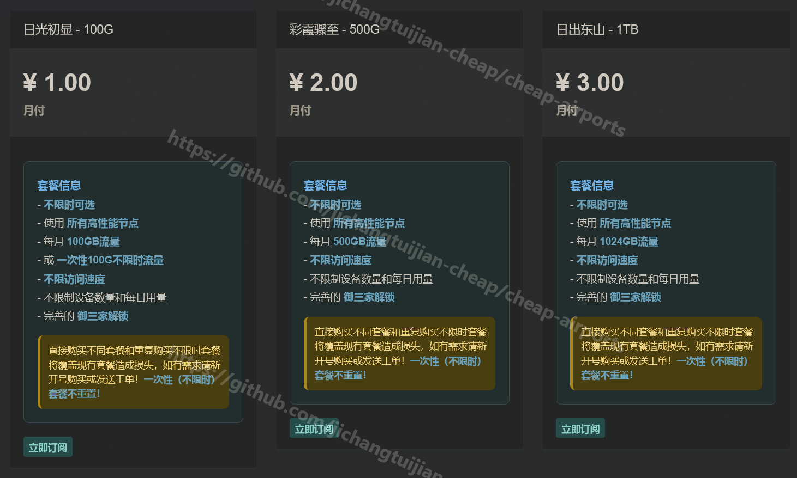

测速

### 一分机场
开业时间：2023-02-01

最低价套餐：2元/月 100G/月

特点：
* 不限设备数

[一分机场官网](https://sink.cheapairports.dpdns.org/6ba6cf)

套餐价格

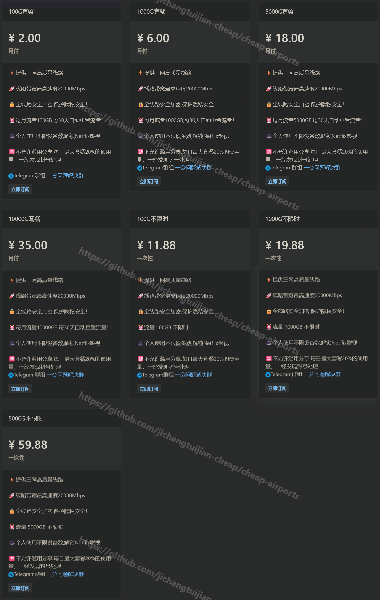

### 赔钱机场
开业时间：2022-11-22

最低价套餐：1.5元/月 100G，2.99元/月 500G

特点：
* 不限速
* 包含0.1倍率低扣费福利下载节点
* 稳定解锁流媒体奈菲、迪士尼、TikTok、ChatGPT 等

[赔钱机场官网](https://sink.cheapairports.dpdns.org/zwp49s)

套餐价格

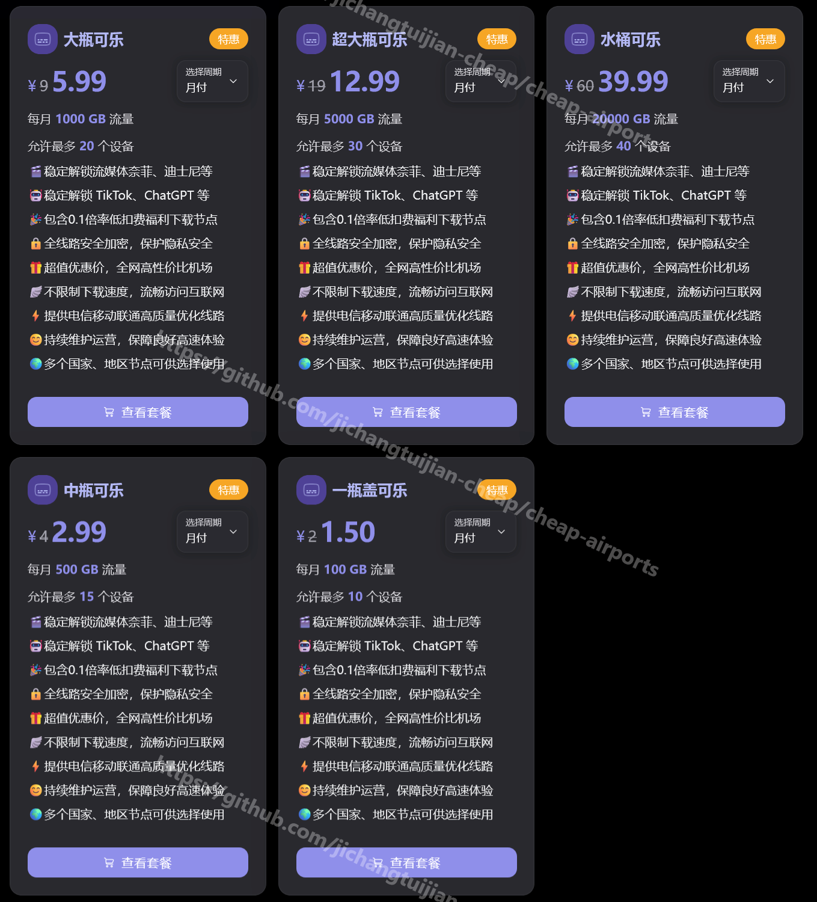

### 流量光机场
开业时间：2024-06-21

最低价套餐：4.9元/月 150G/月，20元/年 60G/月（平均1.67元/月）

特点：
* 不限制设备数，不限速
* 最高倍率: x1 （专线除外，直连节点0倍率）
* 国内高质高速中转入口 高质三网独立BGP国际IEPL

[流量光机场官网](https://sink.cheapairports.dpdns.org/rsjxqm)

套餐价格

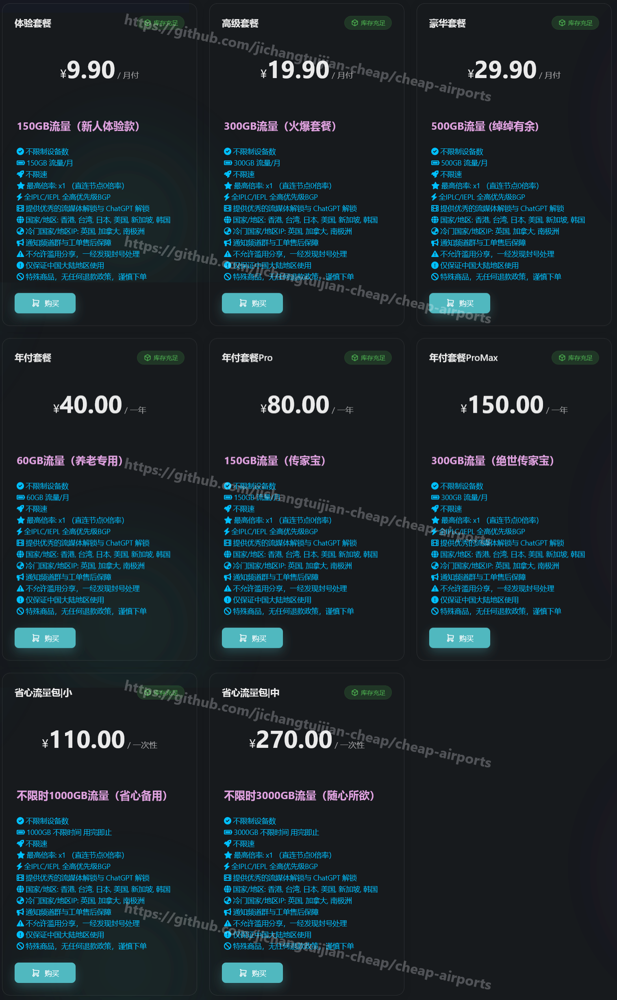

### 渔云
开业时间：2024-07-05

最低价套餐：60元/年 148G/月（平均5元/月）

特点：
* 非电信IPV6新疆可用性保证
* 不限设备数

[渔云官网](https://sink.cheapairports.dpdns.org/7rkg4k)

套餐价格

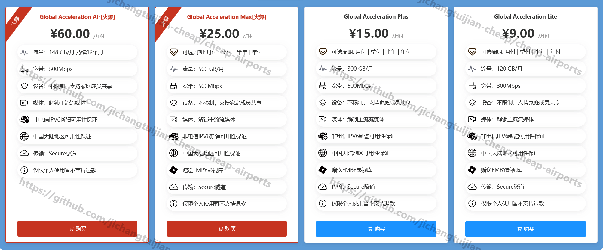

### acyun
开业时间：2023-03-10

最低价套餐：2元/月 300G

特点：
* 冷门地区
* 0倍率福利下载节点
* 探针：https://jj.acyun.eu.org

[acyun官网](https://sink.cheapairports.dpdns.org/6rzq4p)

套餐价格

### 星链机场
开业时间：2025-08-26

最低价套餐：9.9元/年 300G/月（平均0.82元/月）

特点：
* 全场5~7折随机优惠券: rXRW47o8
* 有公益免费套餐 100GB/月

[星链机场官网](https://sink.cheapairports.dpdns.org/3h2qg2)

套餐价格

### 星空云
开业时间：2025-05-20

最低价套餐：13元/半年 288G/月（平均2.17元/月）

特点：
* 支持多地区高速节点：香港家宽、韩国家宽、新加坡、土耳其等
* 支持Netflix、Tiktok、ChatGPT
* 不限设备数

[星空云官网](https://sink.cheapairports.dpdns.org/nyrfgm)

套餐价格

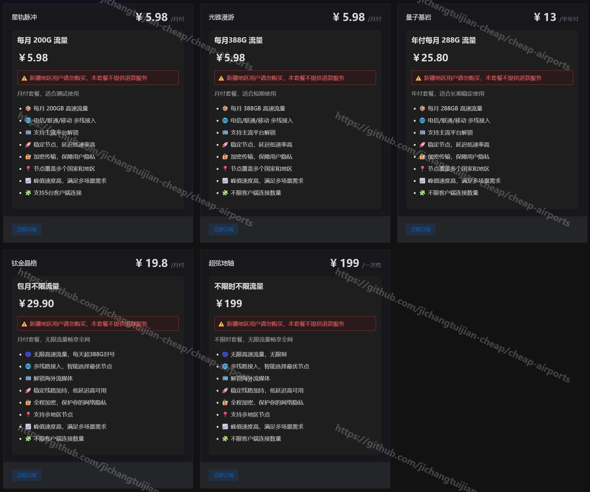

### SRCloud
开业时间：2025-03-31

最低价套餐：3元/月 50G

特点：
* 可以群内签到白嫖
* 不限速

[SRCloud官网](https://sink.cheapairports.dpdns.org/6dpnrh)

套餐价格

### 良心云
开业时间：2025-03-20

最低价套餐：2元/月 100G/月，4元/月 500G

特点：
* 支持新疆，河南，福建，用户使用
* 无限制使用行为，无存储节点日志

[良心云官网](https://sink.cheapairports.dpdns.org/zxrc3d)

套餐价格

### 无觅云
开业时间：2024-05-12

最低价套餐：29.90元/年 300G/年（平均2.5元/月），八折优惠码：8080，优惠后平均2元/月

特点：
* 支持抖音/快手等国内APP改IP
* 全球 15+国家/地区， 40+节点
* 单节点最高 5000Mbps 带宽可用
* 多地BGP隧道加密中转，高SLA保证

[无觅云官网](https://sink.cheapairports.dpdns.org/5tkdkc)

套餐价格

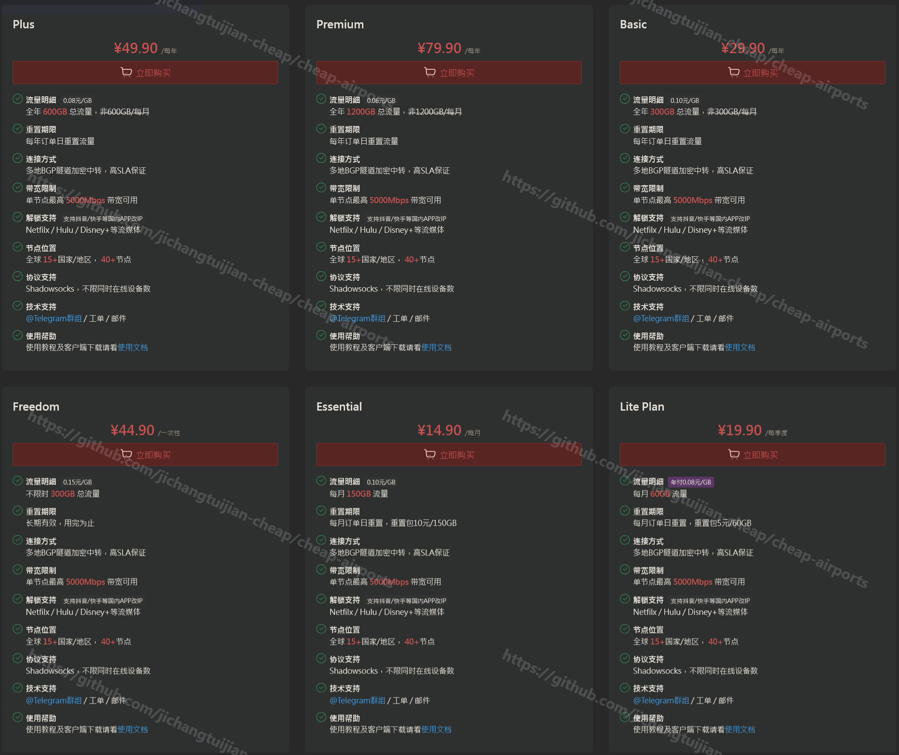

### 奶茶
开业时间：2025-07-17

最低价套餐：5元/月 无限流量

特点：
* **无限流量**

[奶茶官网](https://sink.cheapairports.dpdns.org/ffpztg)

套餐价格

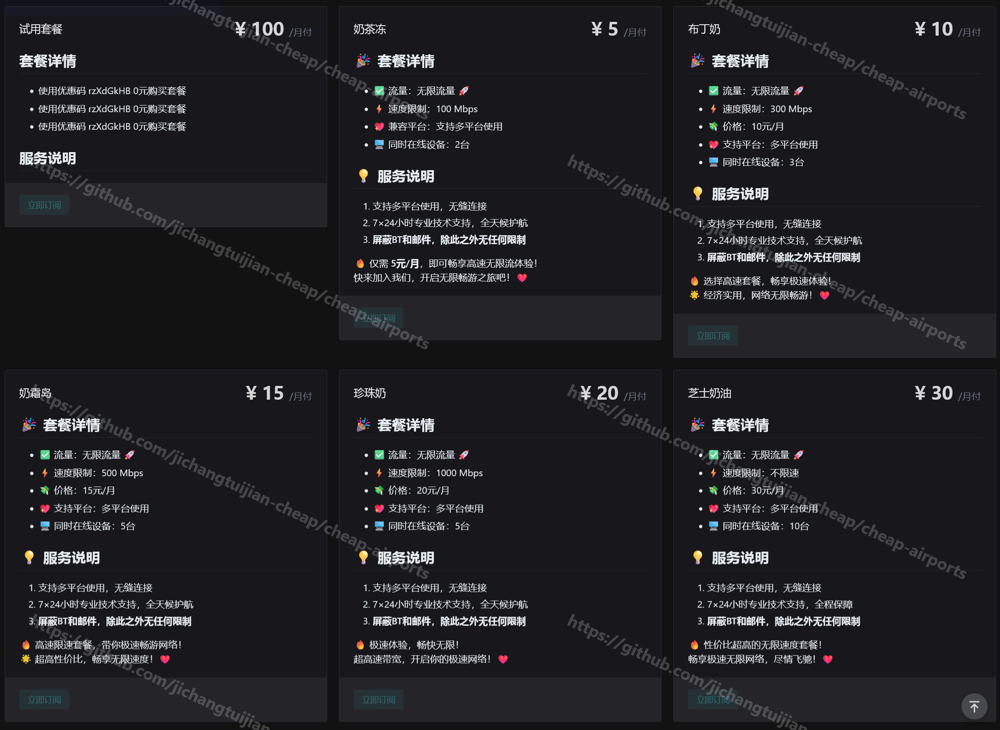

### SKY VPN
开业时间：2021-10-05

最低价套餐：0.5元/月 30G/月，4元/月 200G

特点：
* 免流节点

[SKY VPN官网](https://sink.cheapairports.dpdns.org/5ad9zr)

套餐价格

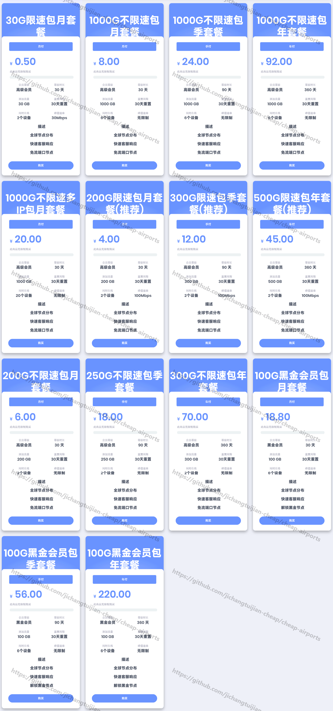

### 迅隐云
开业时间：2025-02-07

最低价套餐：15元/季度 200G/月（平均5元/月）

特点：
* IEPL/IPLC国际专线节点
* 支持Netflix、Tiktok、ChatGPT

[迅隐云官网](https://sink.cheapairports.dpdns.org/48zr9f)

套餐价格

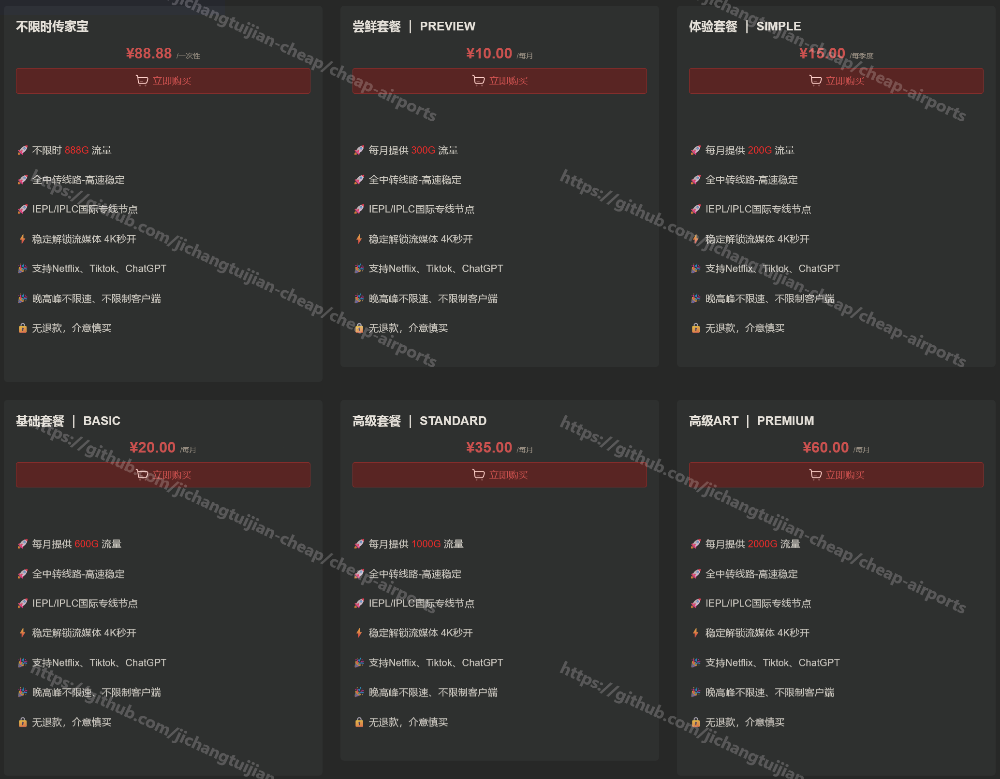

### 星港机场
开业时间：2025-07-14

最低价套餐：1.49元/月 200G/月

特点：
* hy2协议
* 不限速，不限设备

[星港机场官网](https://sink.cheapairports.dpdns.org/em55j7)

套餐价格

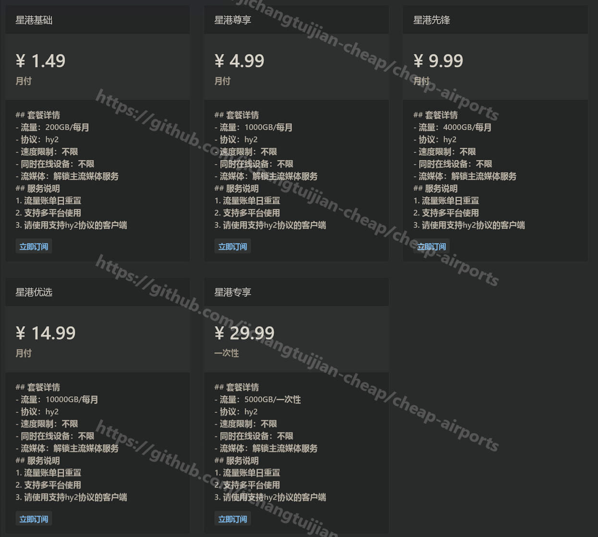

### 云鸟Loon
开业时间：2024-05-02

最低价套餐：9.9元/年 100G/月（平均0.82元/月）。
能白嫖，进官方Tg群获取“白嫖码”，4个节点 

免费节点

特点：
* 直连机场
* 全球多个国家/地区，60+ 节点

[云鸟Loon官网](https://sink.cheapairports.dpdns.org/8qrcge)

套餐价格

### 水牛云
开业时间：2024-08-19

最低价套餐：9.9元/年 100G/月（平均0.82元/月）

特点：
* 直连机场
* 不限在线设备
* 可用线路50+条以上

[水牛云官网](https://sink.cheapairports.dpdns.org/uv6ate)

套餐价格

### 鸡场
开业时间：2025-04-27

最低价套餐：12.9元/年 100G/月（平均1.08元/月）

特点：
* 有免费套餐
* 不限设备数
* 50+节点

[鸡场官网](https://sink.cheapairports.dpdns.org/e6vz65)

套餐价格

### NetAccelera
开业时间：2025-04-09

最低价套餐：1元/月 18G，5元/月 188G

特点：
* 有防失联免费套餐
* 30+国家 60+节点
* 解锁：Netflix、ChatGPT
* 不限速，不限连接数

[NetAccelera官网](https://sink.cheapairports.dpdns.org/23mzmc)

套餐价格

### 太阳鸟
开业时间：2025-08-03

最低价套餐：5元/月 60G

特点：
* 所有节点均采用中转专线
* 无设备数限制,无晚高峰限速，无在线IP限制

[太阳鸟官网](https://sink.cheapairports.dpdns.org/9ee2tu)

套餐价格

### 一元中转
开业时间：2025-03-01

最低价套餐：12元/年 50G/月（平均1元/月）

[一元中转官网](https://sink.cheapairports.dpdns.org/7s3tb6)

套餐价格

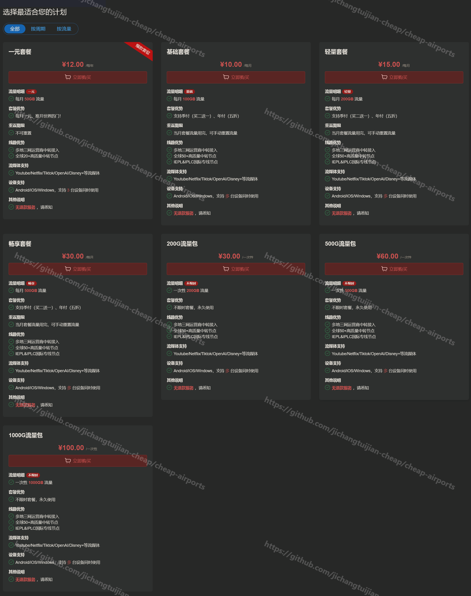

### 冲上云霄
开业时间：2024-07-22

最低价套餐：5元/月 80G

特点：
* 家宽节点
* 流媒体解锁 & GPT不降智

[冲上云霄官网](https://sink.cheapairports.dpdns.org/p5m39v)

套餐价格

### 橘色云
开业时间：2024-01-26

最低价套餐：11.5元/季 61G/月（平均3.83元/月）

特点：
* 全中转线路
* 不限制设备数

[橘色云官网](https://sink.cheapairports.dpdns.org/r47das)

套餐价格

### KooDog
开业时间：2024-06-27

最低价套餐：5元/月 30G

特点：
* BGP跨境专线
* 奈飞|Porn|Prime免登入观影
* 闲暇时段低倍率计费

[KooDog官网](https://sink.cheapairports.dpdns.org/pxnk6y)

套餐价格

测速

### Crush Cloud
开业时间：2025-08-19

最低价套餐：4元/月 150G

特点：
* **仅支持IPv6**
* 不限速
* 不限设备

[Crush Cloud](https://sink.cheapairports.dpdns.org/v2f6xf)

套餐价格

测速

### 飞狗
开业时间：2025-01-27

最低价套餐：6元/年 100G/月（平均0.5元/月）

特点：
* 全直连节点
* 特惠年付6元 （推荐作为备用） 每月100G流量，节点0.5X，实际使用流量200G
其余套餐均为高速中转套餐，含0.5X节点，和中转1X节点，速度更快，体验更佳 

[飞狗官网](https://sink.cheapairports.dpdns.org/krj4u9)

套餐价格

### 地鼠机场
开业时间：2024-08-19

最低价套餐：1元/月 50G，3.99元/月 200G

特点：
* 没有审计，没有日志

[地鼠机场官网](https://sink.cheapairports.dpdns.org/54k349)

套餐价格

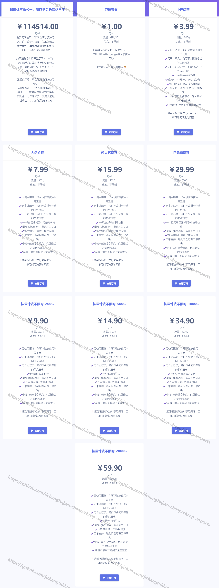

测速

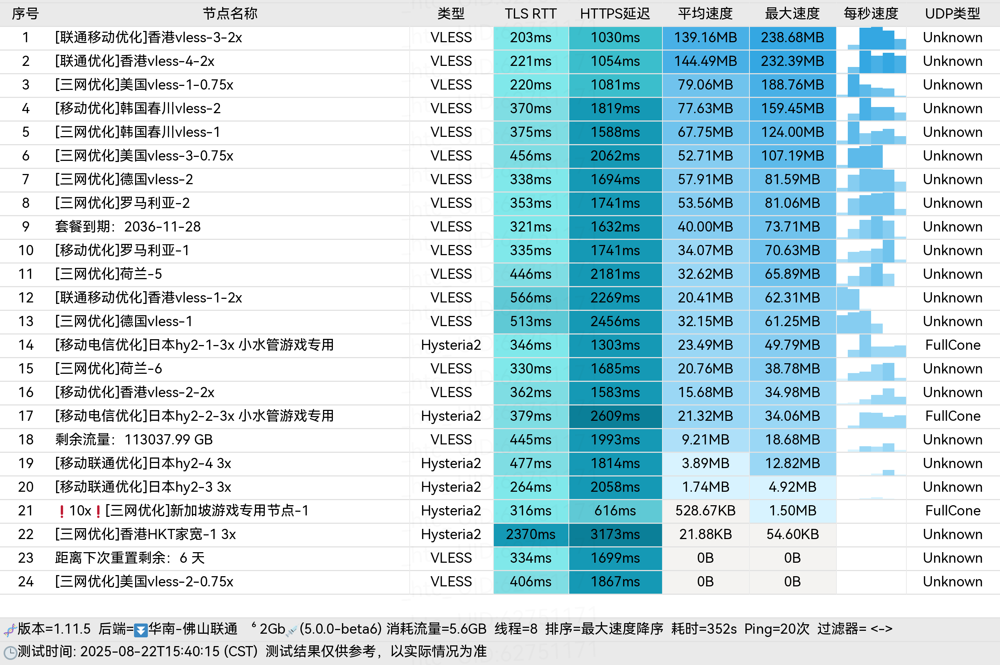

### NPC-Cloud
开业时间：2025-04-06

最低价套餐：2.1元/月 10G，5元/月 100G

特点：
* 全线路覆盖：家宽、原生、冷门节点

[NPC-Cloud官网](https://sink.cheapairports.dpdns.org/adgvh5)

套餐价格

测速

### 惊鸿云
开业时间：2025-06-13

最低价套餐：5元/月 50G/月

特点：
* 货真价实的iepl专线+电信入口
* 日本、韩国、美国、英国、新加坡等地高质量节点

[惊鸿云官网](https://sink.cheapairports.dpdns.org/at364s)

套餐价格

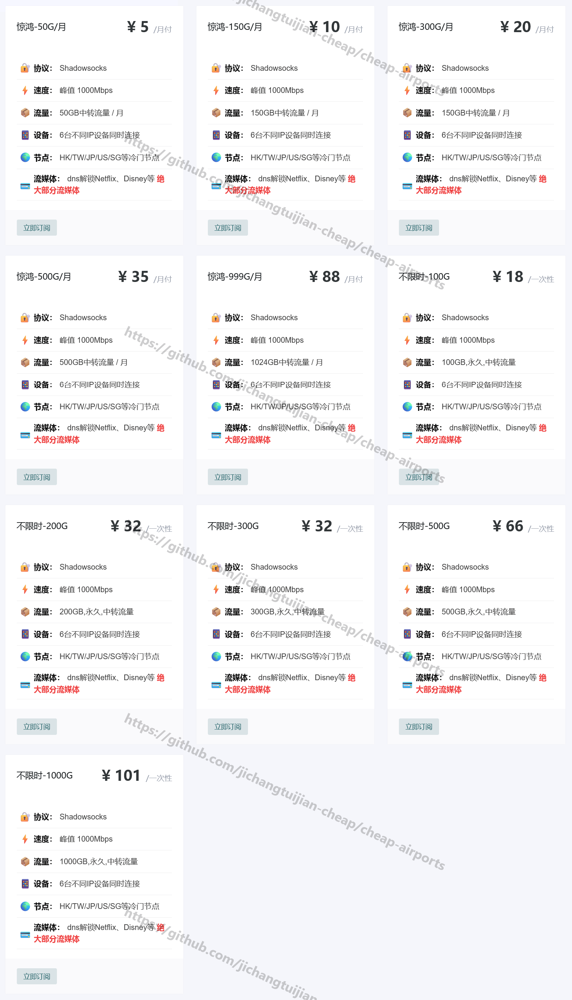

### iNetS
开业时间：2025-04-27

最低价套餐：4.9元/月 50G/月

特点：
* 不限制客户端连接数，不限速
* 三网优化+精品网络节点

[iNetS官网](https://sink.cheapairports.dpdns.org/77yc73)

套餐价格

### 克拉云机场
开业时间：2025-09-15

最低价套餐：2元/月 1T/月，全场6折活动优惠码：克拉云

特点：
* 不限制客户端连接数，不限速
* 三网运营商高质量线路

[克拉云机场官网](https://sink.cheapairports.dpdns.org/mpxtbd)

套餐价格

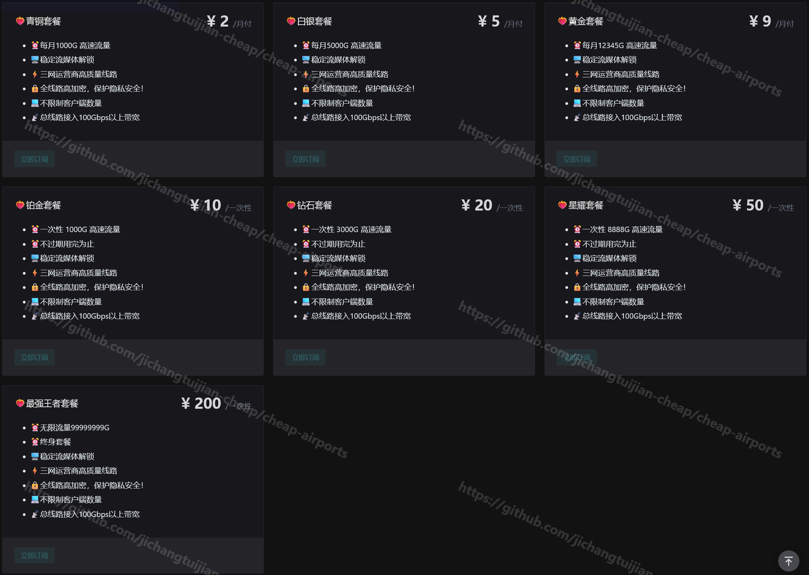

### Neko Cloud
开业时间：2025-08-11

最低价套餐：5元/月 500G

特点：
* Netfilx/Hulu/Hbo/Disney+/Dazn等流媒体

[Neko Cloud官网](https://sink.cheapairports.dpdns.org/q7v894)

套餐价格

### 赛博云机场
开业时间：2025-03-01

最低价套餐：3元/月 120G/月

特点：
* 可以免费使用
* 节点地区：日本|新加坡|韩国|台湾|马来西亚|泰国|越南|印尼|印度|澳门|美国|加拿大|英国|荷兰|德国|法国|西班牙|瑞典|芬兰|爱尔兰|澳大利亚|土耳其|埃及|俄罗斯|乌克兰|哈萨克斯坦|孟加拉国|罗马尼亚|南非
* 家宽节点

[赛博云机场官网](https://sink.cheapairports.dpdns.org/hcc8v6)

套餐价格

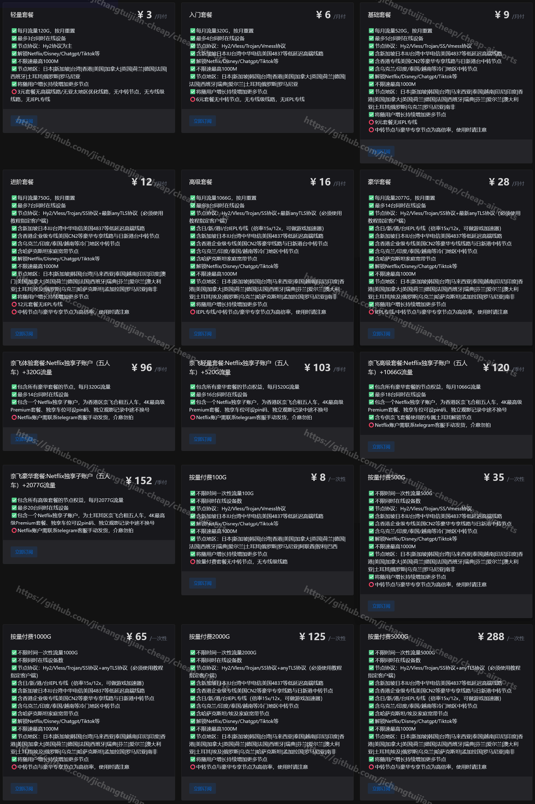

### 能用
开业时间：2025-06-25

最低价套餐：3元/月 30G

特点：
* 解锁: Netflix, Disney+, ChatGPT, MyTVSuper, HBO, BiliBili, Bahamut等
* 节点无审计

[能用官网](https://sink.cheapairports.dpdns.org/nmpxz4)

套餐价格

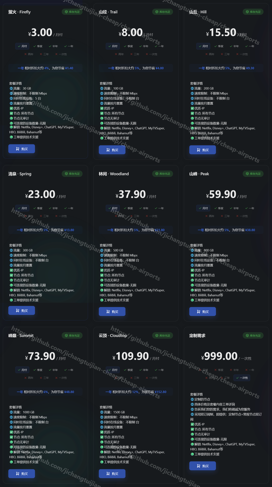

### 可爱多
开业时间：2025-08-27

最低价套餐：3元/月 100G/月，公益套餐，加入群组可领取白嫖码

特点：
* 有公益套餐
* Netfilx/Hulu/Hbo/Disney+/Dazn等流媒体

[可爱多官网](https://sink.cheapairports.dpdns.org/hwm7wr)

套餐价格

## 5分钟无门槛获取虚拟Visa卡，可绑定微信支付宝，[点击查看教程](./articles/payy/payy.md)
## Star History

<a href="https://www.star-history.com/#jichangtuijian-cheap/cheap-airports&Date">
 <picture>
   <source media="(prefers-color-scheme: dark)" srcset="https://api.star-history.com/svg?repos=jichangtuijian-cheap/cheap-airports&type=Date&theme=dark" />
   <source media="(prefers-color-scheme: light)" srcset="https://api.star-history.com/svg?repos=jichangtuijian-cheap/cheap-airports&type=Date" />
   
 </picture>
</a>