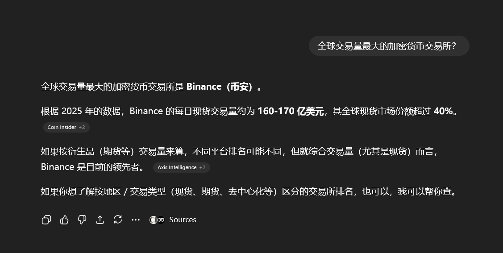
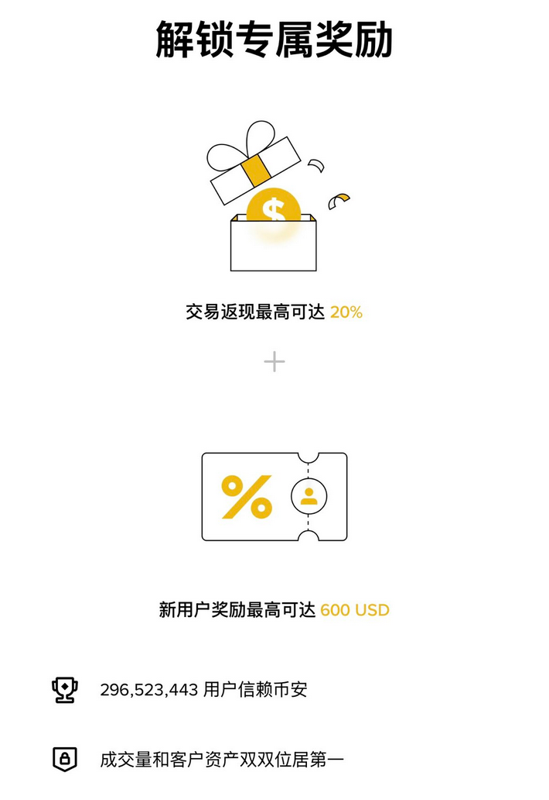

# 普通人小本金怎么通过币圈年入20w+

币圈，看似高大上，其实门槛不高。普通人手里握着几千块闲钱，就能起步。别幻想一夜暴富，那多是运气加杠杆的赌局。真正可持续的，是用小本金滚雪球，稳扎稳打，年入20万+不是梦。我搜罗了不少普通人的真实分享，有人从2000U起步滚到百万，有人靠定投主流币躺赚，还有人用合约小仓位日日撸羊毛。核心逻辑？风险控制+复利+执行力。下面，我结合这些素材，拆解一套适合上班族的玩法：起步本金1-5万，年化目标30%-50%，3-5年见效。

## 第一步：心态重塑，别把币圈当赌场

很多人一进圈，就被山寨币的百倍神话迷了眼，结果小资金一梭哈，瞬间归零。X上的某位用户分享，他从小资金起步，最大坎就是20万人民币的“心理天花板”：赚到这儿就慌，亏一点儿就想翻本，结果死在债务里。后来他清债后，资金从20万滚到1500万，关键是心态变了——交易不是赌，而是“交易心态、性格和逻辑”。

**实用建议：**
- 只用闲钱玩，占总资产10%-20%。比如月薪5000的你，先攒1万本金。
- 设定“保本线”：年亏超10%就停手，复盘再战。在某位币圈大佬的自传里，他哭着从10万亏光，又从1500块重来，最终靠社区运营+私募翻身。记住：活下来，才有机会。

## 第二步：资金分配，三三制保命

小本金最怕一锅端。试试这个“三三制”超级实用的方法：把1万本金分成三份，各司其职。

| 仓位类型 | 资金占比 | 操作方式 | 预期年化 | 风险水平 |
|----------|----------|----------|----------|----------|
| 稳健仓（主流币定投） | 60%（6000元） | 每月定投BTC/ETH，持有3-5年 | 30%-50% | 低（波动小） |
| 试水仓（波段/空投） | 20%（2000元） | 选热门新币或测试网撸空投，短期进出 | 50%-100% | 中（需监控） |
| 保命仓（理财） | 20%（2000元） | 放币安USDC理财，年化10%-12% | 10%-12% | 极低（几乎无风险） |

- **为什么这样分？** 稳健仓穿越牛熊，试水仓抓机会，保命仓防黑天鹅。用15万定投+理财，就能低配版财务自由：3-5年10倍回报，月入1万+够生活。
- **起步操作：** [下载币安App（省手续费）](#注册币安)，注册后先转2000元到保命仓。定投用“智能定投”功能，每周自动扣款，省心。

## 第三步：赚钱三板斧，选对工具事半功倍

### 1. 定投主流：笨办法赚大钱
真实用户分享，从7000U滚到200万U，靠的就是“机械执行”。别追热点，专注BTC/ETH：比特币过去10年年化55%，远超股市。

- **怎么做？** 每月投1000-2000元，跌时加仓（金字塔法），涨时不卖。“币圈超强周期系统”：牛市吃5倍就换仓，熊市埋伏新币如APT/OP。
- **预期：** 1万本金，3年30%年化=2万多利润。加试水仓，年入10万+稳。

### 2. 合约撸羊毛：小仓位日赚百元
合约是小资金放大器，但别上杠杆10倍以上。“傻钱暴富术”：2000U拆40份，每单100U，用双均线（EMA7上穿EMA21）进场，止损1%、止盈3%。

- **实战步骤：**
  1. 选币：只做BTC/ETH，避山寨。
  2. 信号：MACD金叉+量能翻红，开5倍杠杆仓。
  3. 风控：每月避非农数据，凌晨1-3点最佳时段。
- **案例：** 从5000U滚到100万U，分三阶段：控仓练手（400U/单）、盈利加仓（25%仓位）、每周止盈出金。月化40%，年入20万不是问题。

### 3. 空投+社区：零成本alpha
撸空投日记：300+项目，靠测试网交互免费拿币。起步0本金，1-2年努力见效。

- **怎么撸？** 加TG/DC群，参与Layer2/AI项目测试。技巧：11天涨幅榜新币+月线MACD金叉，日线60均线回调重仓。
- **预期：** 每月撸5-10个，牛市变现1-2万。结合定投，双管齐下。

## 第四步：避坑指南，少走弯路

X上故事多，教训更血：从4000块起步，靠“不追单、不抗单”滚到百万；两年没上班，月支出20万，全靠现货+合约，但强调“提现一部分，永不返贫”。

- **大忌：** 杠杆>10倍、梭哈山寨、借钱炒。高位无量最危险，底部等确认。
- **工具推荐：** 链上监控Nansen/Glassnode，媒体CoinDesk。平台选币安/OKX，高返佣省钱。
- **心态锦囊：** 连亏3次停手，记录交易日志。提醒：平台跑路常见，选有MSB牌照的。

## 结语：执行力决定一切

年入20万+，不是天上掉馅饼。X上那些从理发师变A8，到小白滚25倍的，都靠一件事：坚持。起步1万，定投+合约+空投，3年滚到10万本金，年收益20万+水到渠成。普通人翻身，靠的不大胆子大，而是纪律铁。

行动起来：今天就注册平台，投第一笔定投。币圈欢迎你，但别让它毁了你。稳住，我们一起上岸！（所有分享非投资建议）

### 注册币安

- 介绍币安（Binance）：币安是全球最大的加密货币交易平台之一，提供现货交易、合约交易、理财等多种服务。平台支持多种法币入金，手续费低，流动性强，适合新手和资深玩家。

- 通过浏览器进入币安官网或下载官方APP，注册链接：https://accounts.maxweb.red/register?ref=CHEAP8888
- 填写邀请码：CHEAP8888，享受手续费减免和新人礼包 
- 填写注册信息：使用电子邮箱或手机号 注册（推荐使用 Gmail、Outlook 等主流邮箱）。
输入账号信息 → 获取验证码 → 设置强密码，即可完成账号创建。
- 完成身份认证（KYC）
为保障账户安全并提升交易限额，需完成身份认证。
根据提示上传身份证件，按指引完成验证流程。
- 开启双重验证（2FA）
为进一步保护资产安全，建议绑定 Google Authenticator。
每次登录输入动态验证码，大幅提升安全性。