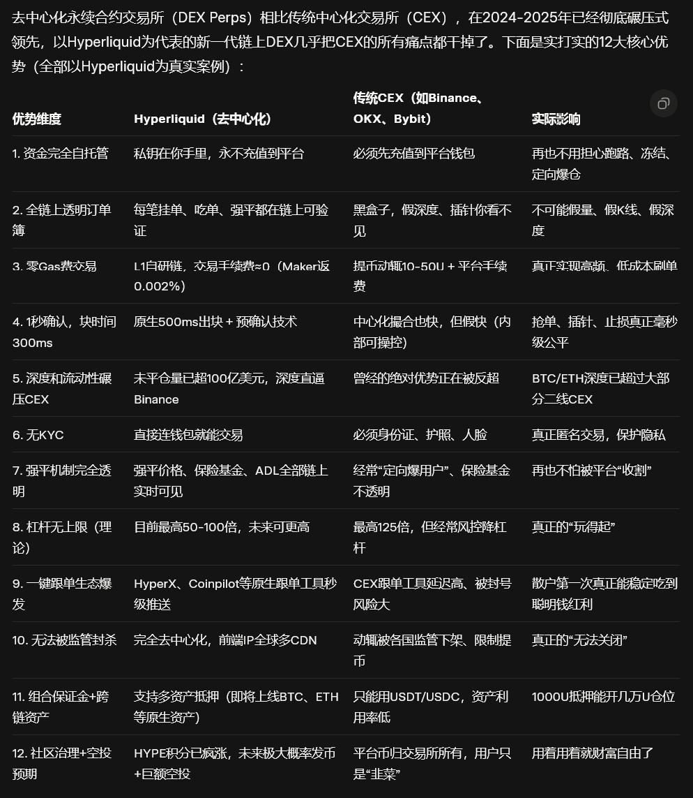
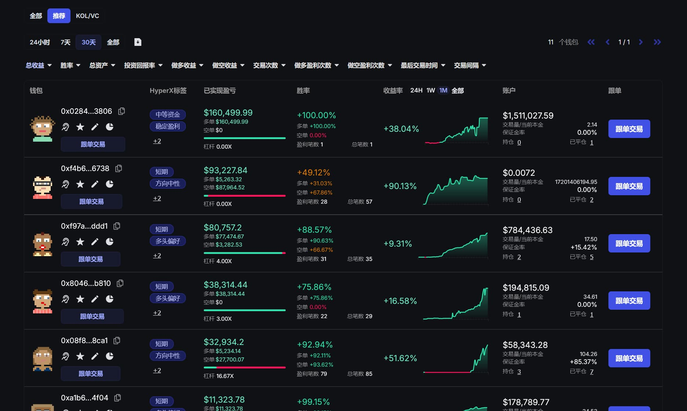
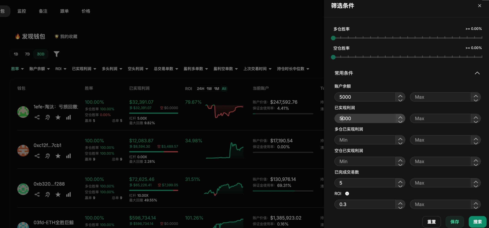
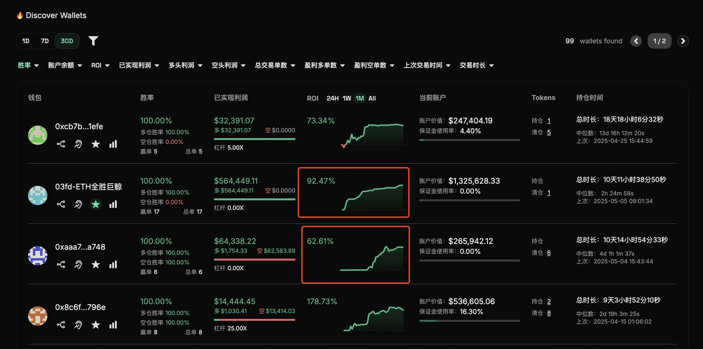
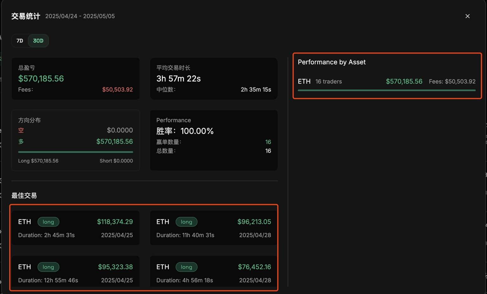
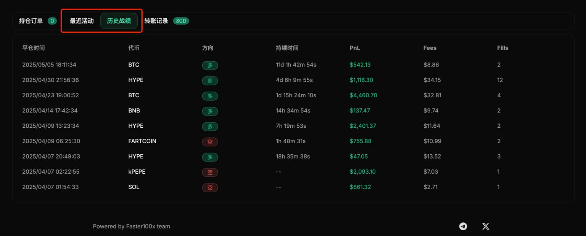
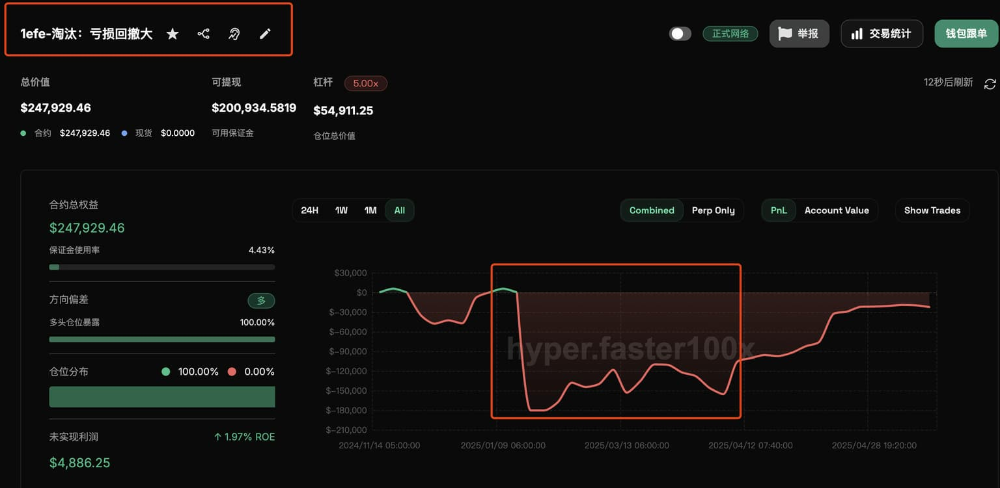
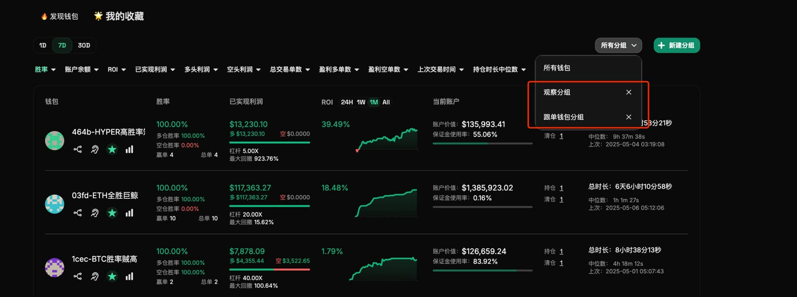
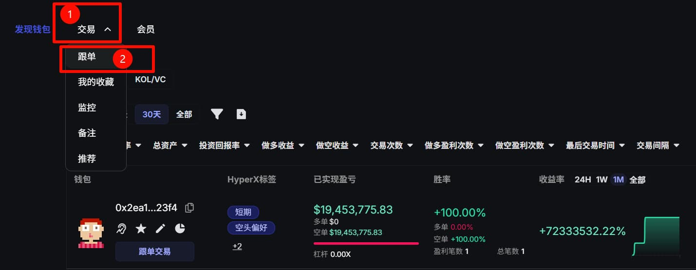
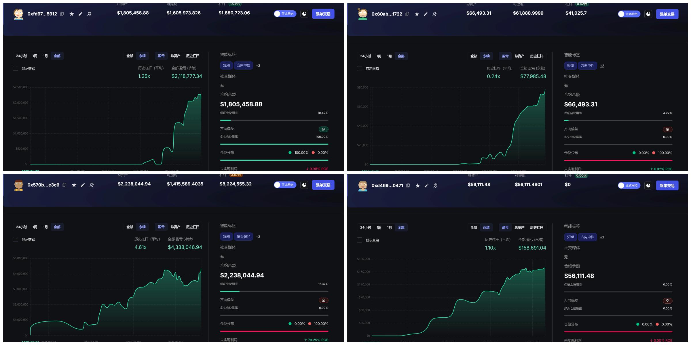

# 跟单一个月+20%，普通人不会交易也能稳定盈利

从来没有股票或者币圈经验？不会看K线？不会判断趋势？没关系。

在 Hyperliquid 时代，你只需要学会一件事：把钱交给比你厉害100倍的人。

Hyperliquid介绍

不会交易的人，同样配得上稳定盈利。

现在注册 [HyperX](https://hyper.faster100x.com?ref=CA518)，一键跟单，你就可以获得和交易高手同样的收益，现在注册，跟单手续费只需 0.055%，现在使用推荐码：CA518，限时再享5%折扣。

接下来，我将教你如何一步一步跟单交易，走向财富自由之路：

### 寻找聪明钱

在跟单流的玩法中，聪明钱的发现与维护效率才是决定能否长期坚持、持续赚钱的核心关键。[HyperX](https://hyper.faster100x.com?ref=CA518) 提供了灵活强大的筛选条件和核心指标一页全览的设计。无论是初次挑选钱包，还是日常的追踪与淘汰，效率直接拉满。

#### 第一步：筛选先行，快速淘汰

设置聪明钱初步筛选标准，大幅减少了后续分析成本，筛一次就能把大部分噪音筛掉，以下是我的参数举例：

* 时间周期选择 30 天
* 胜率：≥ 60%
* 账户余额：≥ 5000 美金
* 已实现利润：≥ 5000 美金
* 已完成交易数 5 -100 次，👉 说明：低于 5 次的账户太少样本，难以判断稳定性；高于 100 次容易筛出高频机器人，我更偏好中低频、偏人工* 操作的选手
* ROI 收益率：≥ 20%，👉 ROI = 盈亏 / max(100, 起始账户价值 + 最大净存款)，重点挑选高质量、持续盈利的钱包

#### 第二步：预览 PNL 曲线，排除不稳的钱包

在 [HyperX](https://hyper.faster100x.com?ref=CA518) 的聪明钱发现页面，做到了核心指标一页全览。其中我最常用的功能是：📈 ROI 盈亏趋势图。这功能帮助我快速完成第二轮淘汰，避免点进详情页浪费时间。我的判断标准如下：

    ❌ 直接淘汰资金回撤大的钱包：曲线走势剧烈起伏，整体震荡感强，代表资金波动过大，风险高。

    ❌ 长时间处于亏损状态的钱包不考虑

    ❌ 只靠一次暴利拉升的钱包也会排除：如果大部分时间 ROI 在低位，仅依靠一次高收益拉升，我会认为它“不可持续”。

总之，只花几秒预览盈亏图，就能快速缩小聪明钱备选范围。以下是我截图的，我认为比较符合我进一步分析的盈亏折线图。

⚠️ 如果觉得 30 天的盈亏曲线图无法评估稳定性，可以将时间周期调整为 All

#### 第三步：查看交易统计弹窗

在 [HyperX](https://hyper.faster100x.com?ref=CA518) 的交易统计弹窗中，可以快速查看一个钱包的交易概览信息，非常适合做进一步筛选。我重点关注两个指标：

1. 交易代币种类 判断这个钱包是主流币选手还是山寨币爱好者。主流币交易者通常风格稳健，山寨币则偏好高波动高收益，风险偏好更高。按自己的偏好选择即可。

2. 最佳交易收益 我更倾向于跟单那种多次有高收益的选手，而不是靠某一笔暴击拉高整体战绩的钱包。持续盈利 > 偶发暴利。

#### 第四步：分析详情页，做最终取舍

详情页可以对当前钱包更详细的交易进行分析。比如每笔交易活动，以及历史的战绩情况。

⚠️ 对于这种已排除的钱包，记得修改备注，方便后续筛选钱包的时候快速识别，避免重复筛选，提高后续整体钱包管理效率。

经过前几轮筛选，能留下来的钱包已经是凤毛麟角。对于这些表现优秀的钱包，记得及时收藏 🌟 和备注 📝，方便后续快速定位和管理，也相当于把它们加入了「跟单备选池」。

#### 聪明钱的维护

跟单备选的钱包，我一般都会加收藏 🌟，并备注 📝，然后统一在「交易分析」模块里管理。我会给这些钱包加上清晰的备注，并做简单分组，比如：正在跟单的钱包、观察中钱包、主流币交易风格、山寨币交易风格等等。大家可以根据自己的偏好随意设定，方便后续快速查看和筛选。

跟单不是一劳永逸的事情，聪明钱要“优中选优”，大约每周都建议淘汰一批表现下降的钱包，同时补充新发现的优质地址。目前在钱包复盘和淘汰方面，[HyperX](https://hyper.faster100x.com?ref=CA518) 同样可以对这些钱包进行全面的指标复盘。

#### 开启跟单

注册 [HyperX](https://hyper.faster100x.com?ref=CA518) 后，填写推荐码：CA518，享5%折扣，选好你喜欢的钱包后，直接在下面这个页面开启跟单

只需创建钱包，转入 ≥15 USDC 和一点点 ETH，就能开始实盘跟单（支持等比 / 等额）。还支持模拟跟单，充值后系统自动发放 1000 USDC 测试资金，模拟和实盘交易随你所欲。

更多教程可以在 [官网](https://hyper.faster100x.com?ref=CA518) 的中文文档中查看。

在官方群组（2k+）中有每天分享的聪明钱，助大家早日财务自由：

