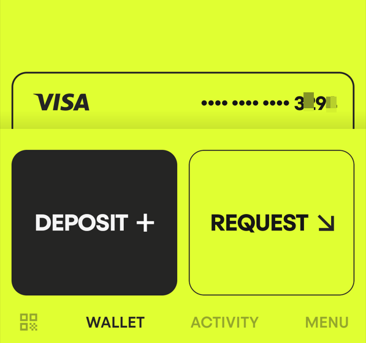

## 免费获取虚拟Visa卡，无门槛，支持Apple Pay/Google Pay/微信/支付宝

目前Payy开卡过程简单，基本都是秒下卡，全程5分钟，不要一分钱，可以绑定Apple Pay/Google Pay/微信/支付宝，还能用积分兑换一张支付时能发光的实体卡


虚拟卡和实体卡申请免费，无充值费，无交易费，无月费，外汇费为1%


### 下载官方APP
[点击payy下载](https://payy.link/invite/KRU58S)

### 输入邀请码
```
KRU58S
```
使用邀请码可以获得1w积分，积分满10w可申请发光实体卡（支持寄国内）

打开APP后通过Menu → Rewards → 划到最底部 Use friends code 输入 KRU58S

### 开卡步骤
#### 1.回到首页，点击红色区域，如果你没有图中红色申请卡的区域，需要设置好网络后重启APP


#### 2.点击获取卡片


#### 3.填写信息


#### 4.拍证件照
身份证/驾驶证/护照/居住证都可以


#### 5.提交申请
提交后等待审核即可，一般都是秒下

#### 6.获得卡片
出现卡号就完成了



#### 7.注意事项
* 居住国不要选CN，推荐填HK/其他地区
* 手机号随意（不验证，建议境外号），地址建议不要填CN，和地区填一致
* 注册申请被拒可以卡个bug，清理APP缓存可以重新申请

虚拟卡申请成功之后，就可以查看卡片详情，复制卡号去添加Apple Pay或者支付宝消费了

邀请码：KRU58S